# System Architecture Analysis
<!-- generated in 0.00s -->

## Overview

- **Project**: /home/tom/github/if-uri/urirun
- **Primary Language**: python
- **Languages**: python: 141, json: 13, shell: 10, yaml: 5, csharp: 4
- **Analysis Mode**: static
- **Total Functions**: 1351
- **Total Classes**: 48
- **Modules**: 201
- **Entry Points**: 522

## Architecture by Module

### adapters.python.urirun.host.host_dashboard
- **Functions**: 85
- **File**: `host_dashboard.py`

### v1.js.urirun-v1
- **Functions**: 68
- **File**: `urirun-v1.js`

### adapters.python.urirun.node.server
- **Functions**: 55
- **Classes**: 3
- **File**: `server.py`

### adapters.python.urirun
- **Functions**: 53
- **Classes**: 1
- **File**: `__init__.py`

### adapters.python.urirun.host.node_cli
- **Functions**: 50
- **File**: `node_cli.py`

### adapters.python.urirun.host.object_registry
- **Functions**: 46
- **File**: `object_registry.py`

### adapters.python.urirun.node.flow
- **Functions**: 42
- **File**: `flow.py`

### adapters.python.urirun.node.twin_store
- **Functions**: 41
- **Classes**: 3
- **File**: `twin_store.py`

### adapters.python.urirun.connectors.connector_lint
- **Functions**: 38
- **File**: `connector_lint.py`

### adapters.python.urirun.node.manage
- **Functions**: 36
- **File**: `manage.py`

### adapters.python.urirun.node.client
- **Functions**: 35
- **Classes**: 1
- **File**: `client.py`

### adapters.python.urirun.host.host_db
- **Functions**: 33
- **File**: `host_db.py`

### adapters.python.urirun.node.reversible
- **Functions**: 33
- **Classes**: 8
- **File**: `reversible.py`

### adapters.python.urirun.node.flow_planner
- **Functions**: 31
- **File**: `flow_planner.py`

### adapters.python.urirun.host.discovery
- **Functions**: 29
- **File**: `discovery.py`

### adapters.python.urirun.host.planfile_adapter
- **Functions**: 27
- **Classes**: 1
- **File**: `planfile_adapter.py`

### adapters.python.urirun.host.chat_orchestrator
- **Functions**: 26
- **Classes**: 1
- **File**: `chat_orchestrator.py`

### adapters.python.urirun.node.flow_thin
- **Functions**: 26
- **Classes**: 1
- **File**: `flow_thin.py`

### adapters.python.urirun.host.dashboard_api
- **Functions**: 25
- **File**: `dashboard_api.py`

### adapters.python.urirun.host.task_cli
- **Functions**: 25
- **File**: `task_cli.py`

## Key Entry Points

Main execution flows into the system:

### adapters.python.urirun.host.host_dashboard.summary
- **Calls**: adapters.python.urirun.host.dashboard_api._safe_tickets, adapters.python.urirun.host.dashboard_api._host_db, adapters.python.urirun.host.dashboard_api._mesh, host_db.recent_checks, _public_artifacts, host_db.recent_logs, _annotate_node_tokens_impl, _annotate_node_kinds

### adapters.python.urirun.node.server.NodeHandler._stream_events
- **Calls**: self.path.partition, adapters.python.urirun.node.server._parse_sse_query, adapters.python.urirun.node.server._sse_initial_cursor, c.hub.subscribe, adapters.python.urirun.node.server.send_json, self.send_response, self.send_header, self.send_header

### scripts.transport_swap_proof.main
- **Calls**: CallableTransport, subprocess.Popen, CallableTransport, print, print, print, scripts.transport_swap_proof.timed, scripts.transport_swap_proof.timed

### adapters.python.urirun.host.connector_admin.connector_install
> Install a URI connector on the host or a node from a chosen source.
- **Calls**: None.strip, target.startswith, None.lower, None.strip, adapters.python.urirun.host.connector_admin.connector_pip_tail, isinstance, adapters.python.urirun.host.connector_admin._connector_install_node, subprocess.run

### adapters.python.urirun.host.chat_orchestrator.chat_ask
- **Calls**: None.strip, list, list, adapters.python.urirun.host.routing.selected_nodes_from_targets, bool, bool, adapters.python.urirun.host.chat_orchestrator._add_chat_user_message, is_phone_scanner_prompt

### adapters.python.urirun.node.server.NodeHandler._handle_deploy
- **Calls**: adapters.python.urirun.node.server.read_raw, body.get, print, adapters.python.urirun.node.server.send_json, adapters.python.urirun.node.server.send_json, self._admin_ok, adapters.python.urirun.node.server.send_json, json.loads

### adapters.python.urirun.node.server.NodeHandler._handle_run
- **Calls**: adapters.python.urirun.node.server.read_raw, self._validate_run_request, str, self._dispatch_control_uri, self._run_target, _normalize_request, progress.RunControl, adapters.python.urirun.node.server.send_json

### adapters.python.urirun.Connector._build_cli_parser
> Build the connector argparse parser (one subcommand per route).
- **Calls**: argparse.ArgumentParser, parser.add_subparsers, sub.add_parser, sub.add_parser, sub.add_parser, self._add_route_arguments, None.get, None.split

### adapters.python.urirun.node.client.NodeClient.resolve_refs
> Chain steps: replace "$ref:<i>.<field.path>" with an earlier step's output.
- **Calls**: isinstance, isinstance, isinstance, re.match, re.sub, NodeClient.resolve_refs, NodeClient.resolve_refs, int

### adapters.python.urirun.connectors.connect_catalog._cmd_show
- **Calls**: adapters.python.urirun.connectors.connect_catalog.fetch_connector, print, print, print, print, print, document.get, adapters.python.urirun.connectors.connect_catalog._emit_json

### adapters.python.urirun.node.server.NodeHandler._handle_enroll
- **Calls**: adapters.python.urirun.node.server.read_raw, keyauth.verify_request, keyauth.token_matches, print, adapters.python.urirun.node.server.send_json, adapters.python.urirun.node.server.send_json, keyauth.available, adapters.python.urirun.node.server.send_json

### adapters.python.urirun.node.flow._uri_memory_remember
> Handler for twin://host/memory/command/remember.

Payload: {nodes: [str], routes?: [{…}], flow_key?: str,
          record: {steps: […], …}}
Returns: 
- **Calls**: adapters.python.urirun.node.routing.registry_from_routes, str, adapters.python.urirun.node.reversible.durable_memory, dict, record.setdefault, bool, urirun.ok, payload.get

### adapters.python.urirun.node.manage.connector_install
> Install a connector from ANY source into the node's venv:
- a catalog id ("browser-control") → urirun-connector-<id> (PyPI, then if-uri GitHub),
- a l
- **Calls**: None.strip, adapters.python.urirun.node.manage._classify_source, adapters.python.urirun.node.manage._install_policy, adapters.python.urirun.node.manage._policy_allows, res.get, payload.get, payload.get, payload.get

### examples.matrix.verify.main
- **Calls**: contracts.get, sorted, None.removesuffix, adapters.python.urirun.validate_binding_document, examples.matrix.verify.essential, contracts.items, json.load, print

### adapters.python.urirun.host.contracts.file_transfer_verification
> Return the standard verification contract for file-copy style URI flows.

`uploaded` means the remote write acknowledged the file. `verified` means th
- **Calls**: list, set, set, adapters.python.urirun.host.contracts.verification_check, adapters.python.urirun.host.contracts.verification_check, all, len, len

### adapters.python.urirun.connectors.connect_catalog._cmd_list
- **Calls**: adapters.python.urirun.connectors.connect_catalog.fetch_catalog, adapters.python.urirun.connectors.connect_catalog._connectors, getattr, max, adapters.python.urirun.connectors.connect_catalog._emit_json, print, None.join, print

### adapters.python.urirun.host.twin_bridge.api_twin_state
- **Calls**: _durable_memory, int, mem.known_good_flows, adapters.python.urirun.host.twin_bridge._nodes_from_store, getattr, adapters.python.urirun.host.twin_bridge._split_episodes, hasattr, mem.degraded_flows

### adapters.python.urirun.host.fs_transfer.ensure_node_uri_routes
> Preflight exact URI routes needed by a node-side workflow.

Scheme-level checks are insufficient for split connectors such as fs://:
a node may expose
- **Calls**: adapters.python.urirun.host.fs_transfer.node_client, client.routes, set, adapters.python.urirun.host.fs_transfer.route_key, attempted_route_keys.add, ensured.append, client.routes, all

### adapters.python.urirun.connectors.connector_lint.lint_kernel_symbols
> Static-scan a connector package for calls to kernel symbols absent from the contract.

Returns ``{"violations": [...], "ok": bool}`` where each violat
- **Calls**: Path, adapters.python.urirun.connectors.connector_lint._connector_py_files, adapters.python.urirun.connectors.connector_lint._kernel_direct_imports, adapters.python.urirun.connectors.connector_lint._collect_kernel_imports, adapters.python.urirun.connectors.connector_lint._kernel_attribute_accesses, len, path.read_text, ast.parse

### examples.node-file-transfer.fs_transfer.write_b64
- **Calls**: examples.node-file-transfer.fs_transfer._expand_path, final.with_name, tmp.write_bytes, tmp.replace, target.parent.mkdir, examples.node-file-transfer.fs_transfer._unique_path, base64.b64decode, str

### adapters.python.urirun.host.node_cli.node_command
- **Calls**: adapters.python.urirun.node.config.load_node_config, dict, adapters.python.urirun.host.node_cli._resolve_registry_source, v2.load_registry_arg, reglib._emit_json, adapters.python.urirun.host.node_cli.node_list_command, adapters.python.urirun.host.node_cli.node_stop_command, reglib._emit_json

### adapters.python.urirun.host.android_node.restart_android_node_service
- **Calls**: adapters.python.urirun.host.host_dashboard._service_restart_argv, meta.setdefault, int, adapters.python.urirun.host.android_node.start_android_node_service, isinstance, None.lower, _schedule_restart_command, free_port_fn

### adapters.python.urirun.host.discovery.node_test_routes
> Probe a node's URIs and report which respond.
- **Calls**: None.strip, node_url_from_config, adapters.python.urirun.host.discovery._route_targets, adapters.python.urirun.host.discovery._node_test_summary, None.strip, adapters.python.urirun.host.fs_transfer.node_token_for, adapters.python.urirun.host.fs_transfer.node_client, adapters.python.urirun.host.discovery._probe_route

### adapters.python.urirun.host.object_registry.node_set_token
> Store a node's management token (X-Urirun-Token) the user typed in the Nodes view — into the
OS keyring (the system's secret store), never plaintext. 
- **Calls**: None.strip, str, isinstance, keyring.set_password, node_config.load_host_config, cfg.get, adapters.python.urirun.host.object_registry.probe_node_token, str

### adapters.python.urirun.host.fs_transfer.compact_remote_run
- **Calls**: envelope.get, run.get, isinstance, run.get, isinstance, envelope.get, bool, envelope.get

### adapters.python.urirun.host.fs_transfer.remote_write_error
- **Calls**: isinstance, adapters.python.urirun.host.fs_transfer.envelope_error_message, isinstance, run.get, adapters.python.urirun.host.fs_transfer.route_not_found_remedy, adapters.python.urirun.host.fs_transfer.route_not_found_remedy, adapters.python.urirun.host.fs_transfer.route_not_found_remedy, adapters.python.urirun.host.fs_transfer.envelope_error_message

### adapters.python.urirun.connectors.backend_registry.dispatch
> Run ``action`` through the best available backend, returning a result dict with ``backend``
set, or raising ``BackendError`` with per-backend diagnost
- **Calls**: _REGISTRY.get, adapters.python.urirun.connectors.backend_registry.current_platform, BackendError, BackendError, tried.append, BackendError, b.available, result.setdefault

### adapters.python.urirun.node.client.NodeClient.push_folder
> Host-side: find a folder (abs path, or a dir named `name_or_path` under roots /
~/github) and push its text files to the node's deploy dir (flat, by b
- **Calls**: os.path.expanduser, os.path.isdir, self._read_folder_files, self.deploy, str, dep.get, sorted, dep.get

### adapters.python.urirun.node.client.NodeClient.watch
> Yield the node's SSE events live, each tagged with its `_id`. `scheme`/`run`
filter server-side; `last_event_id` replays what was missed (resume after
- **Calls**: urlencode, self._auth, self._watch_query_params, str, urllib.request.urlopen, urllib.request.Request, None.strip, line.startswith

### scripts.repin_connectors.main
- **Calls**: argparse.ArgumentParser, ap.add_argument, ap.add_argument, ap.add_argument, ap.add_argument, ap.parse_args, scripts.repin_connectors.find_root, sorted

## Process Flows

Key execution flows identified:

### Flow 1: summary
```
summary [adapters.python.urirun.host.host_dashboard]
  └─ →> _safe_tickets
      └─> _planfile_adapter
  └─ →> _host_db
```

### Flow 2: _stream_events
```
_stream_events [adapters.python.urirun.node.server.NodeHandler]
  └─ →> _parse_sse_query
  └─ →> _sse_initial_cursor
```

### Flow 3: main
```
main [scripts.transport_swap_proof]
```

### Flow 4: connector_install
```
connector_install [adapters.python.urirun.host.connector_admin]
  └─> connector_pip_tail
```

### Flow 5: chat_ask
```
chat_ask [adapters.python.urirun.host.chat_orchestrator]
  └─ →> selected_nodes_from_targets
```

### Flow 6: _handle_deploy
```
_handle_deploy [adapters.python.urirun.node.server.NodeHandler]
  └─ →> read_raw
  └─ →> send_json
```

### Flow 7: _handle_run
```
_handle_run [adapters.python.urirun.node.server.NodeHandler]
  └─ →> read_raw
```

### Flow 8: _build_cli_parser
```
_build_cli_parser [adapters.python.urirun.Connector]
```

### Flow 9: resolve_refs
```
resolve_refs [adapters.python.urirun.node.client.NodeClient]
```

### Flow 10: _cmd_show
```
_cmd_show [adapters.python.urirun.connectors.connect_catalog]
  └─> fetch_connector
      └─> _get_json
```

## Key Classes

### adapters.python.urirun.node.client.NodeClient
> Drive one urirun node: ``c = NodeClient("http://host:8765"); c.run(uri, payload)``.
- **Methods**: 33
- **Key Methods**: adapters.python.urirun.node.client.NodeClient.__init__, adapters.python.urirun.node.client.NodeClient._auth, adapters.python.urirun.node.client.NodeClient.routes, adapters.python.urirun.node.client.NodeClient.get, adapters.python.urirun.node.client.NodeClient.concretize, adapters.python.urirun.node.client.NodeClient.run, adapters.python.urirun.node.client.NodeClient.run_async, adapters.python.urirun.node.client.NodeClient.cancel, adapters.python.urirun.node.client.NodeClient.status, adapters.python.urirun.node.client.NodeClient.deploy

### adapters.python.urirun.node.server.NodeHandler
> The node's HTTP surface. State/config live on `self.server.ctx` (a NodeContext),
so this is a normal
- **Methods**: 25
- **Key Methods**: adapters.python.urirun.node.server.NodeHandler.ctx, adapters.python.urirun.node.server.NodeHandler.do_OPTIONS, adapters.python.urirun.node.server.NodeHandler._guarded, adapters.python.urirun.node.server.NodeHandler.do_GET, adapters.python.urirun.node.server.NodeHandler.do_POST, adapters.python.urirun.node.server.NodeHandler._health_payload, adapters.python.urirun.node.server.NodeHandler._routes_payload, adapters.python.urirun.node.server.NodeHandler._get, adapters.python.urirun.node.server.NodeHandler._get_errors, adapters.python.urirun.node.server.NodeHandler._post
- **Inherits**: BaseHTTPRequestHandler

### adapters.python.urirun.node.twin_store.TwinMemory
> Remembers the KNOWN-GOOD environment fingerprint per node (snapshot-on-success), so a later
run dete
- **Methods**: 21
- **Key Methods**: adapters.python.urirun.node.twin_store.TwinMemory.remember, adapters.python.urirun.node.twin_store.TwinMemory.known_good, adapters.python.urirun.node.twin_store.TwinMemory.drift, adapters.python.urirun.node.twin_store.TwinMemory.remember_flow, adapters.python.urirun.node.twin_store.TwinMemory.recall_flow, adapters.python.urirun.node.twin_store.TwinMemory.known_good_flows, adapters.python.urirun.node.twin_store.TwinMemory.degraded_flows, adapters.python.urirun.node.twin_store.TwinMemory.remember_episode, adapters.python.urirun.node.twin_store.TwinMemory.known_good_episodes, adapters.python.urirun.node.twin_store.TwinMemory.recall_episode

### adapters.python.urirun.Connector
> Small convention helper for connector packages.

Connector authors can declare the package once and 
- **Methods**: 16
- **Key Methods**: adapters.python.urirun.Connector.__post_init__, adapters.python.urirun.Connector.uri, adapters.python.urirun.Connector._meta, adapters.python.urirun.Connector.command, adapters.python.urirun.Connector.shell, adapters.python.urirun.Connector.cli, adapters.python.urirun.Connector._add_route_arguments, adapters.python.urirun.Connector._build_cli_parser, adapters.python.urirun.Connector._dispatch_cli, adapters.python.urirun.Connector.handler

### adapters.python.urirun.connectors.connector_contract.ConnectorContractSuite
> pytest-compatible base class for connector contract tests.

Sub-class and set class attributes::

  
- **Methods**: 11
- **Key Methods**: adapters.python.urirun.connectors.connector_contract.ConnectorContractSuite.compile, adapters.python.urirun.connectors.connector_contract.ConnectorContractSuite.dispatch_dry, adapters.python.urirun.connectors.connector_contract.ConnectorContractSuite.dispatch_execute, adapters.python.urirun.connectors.connector_contract.ConnectorContractSuite.assert_ok, adapters.python.urirun.connectors.connector_contract.ConnectorContractSuite.assert_reply_shape, adapters.python.urirun.connectors.connector_contract.ConnectorContractSuite.test_bindings_validate, adapters.python.urirun.connectors.connector_contract.ConnectorContractSuite.test_bindings_compile, adapters.python.urirun.connectors.connector_contract.ConnectorContractSuite.test_bindings_serializable, adapters.python.urirun.connectors.connector_contract.ConnectorContractSuite.test_dry_run_routes_return_valid_reply_shape, adapters.python.urirun.connectors.connector_contract.ConnectorContractSuite.test_execute_cases

### adapters.python.urirun.node.twin_store._NamespacedStore
> Wraps a JsonFileStore so all reads/writes go through a named sub-key.

``store["_flows"]["abc"]`` be
- **Methods**: 9
- **Key Methods**: adapters.python.urirun.node.twin_store._NamespacedStore.__init__, adapters.python.urirun.node.twin_store._NamespacedStore._bucket, adapters.python.urirun.node.twin_store._NamespacedStore.get, adapters.python.urirun.node.twin_store._NamespacedStore.__getitem__, adapters.python.urirun.node.twin_store._NamespacedStore.__contains__, adapters.python.urirun.node.twin_store._NamespacedStore.__setitem__, adapters.python.urirun.node.twin_store._NamespacedStore.values, adapters.python.urirun.node.twin_store._NamespacedStore.items, adapters.python.urirun.node.twin_store._NamespacedStore.keys

### adapters.python.urirun.node.server.EventHub
> In-memory pub/sub for a node's live event stream (SSE). Each subscriber gets a
bounded queue; publis
- **Methods**: 7
- **Key Methods**: adapters.python.urirun.node.server.EventHub.__init__, adapters.python.urirun.node.server.EventHub.publish, adapters.python.urirun.node.server.EventHub.subscribe, adapters.python.urirun.node.server.EventHub.unsubscribe, adapters.python.urirun.node.server.EventHub.replay_since, adapters.python.urirun.node.server.EventHub.current_id, adapters.python.urirun.node.server.EventHub.count

### adapters.python.urirun.node.twin_store.JsonFileStore
> A dict-like store that persists every write to a single JSON file (atomic replace), so a
TwinMemory 
- **Methods**: 7
- **Key Methods**: adapters.python.urirun.node.twin_store.JsonFileStore.__init__, adapters.python.urirun.node.twin_store.JsonFileStore.get, adapters.python.urirun.node.twin_store.JsonFileStore.items, adapters.python.urirun.node.twin_store.JsonFileStore.__getitem__, adapters.python.urirun.node.twin_store.JsonFileStore.__contains__, adapters.python.urirun.node.twin_store.JsonFileStore.__setitem__, adapters.python.urirun.node.twin_store.JsonFileStore._flush

### adapters.php.Urirun.Urirun.Connector
- **Methods**: 5
- **Key Methods**: adapters.php.Urirun.Connector.__construct, adapters.php.Urirun.Connector.target, adapters.php.Urirun.Connector.command, adapters.php.Urirun.Connector.bindings, adapters.php.Urirun.Connector.bindingsJson

### adapters.java.Urirun.Urirun
- **Methods**: 4
- **Key Methods**: adapters.java.Urirun.Urirun.Connector, adapters.java.Urirun.Urirun.Connector, adapters.java.Urirun.Urirun.command, adapters.java.Urirun.Urirun.bindingsJson

### adapters.ts.urirun.Connector
- **Methods**: 4
- **Key Methods**: adapters.ts.urirun.Connector.command, adapters.ts.urirun.Connector.document, adapters.ts.urirun.Connector.toJSON, adapters.ts.urirun.Connector.connector

### adapters.ruby.urirun.Connector
- **Methods**: 4
- **Key Methods**: adapters.ruby.urirun.Connector.initialize, adapters.ruby.urirun.Connector.command, adapters.ruby.urirun.Connector.bindings, adapters.ruby.urirun.Connector.bindings_json

### adapters.python.urirun.connectors.backend_registry.Backend
- **Methods**: 3
- **Key Methods**: adapters.python.urirun.connectors.backend_registry.Backend.missing, adapters.python.urirun.connectors.backend_registry.Backend.platform_ok, adapters.python.urirun.connectors.backend_registry.Backend.available

### adapters.csharp.Urirun.Connector
- **Methods**: 3
- **Key Methods**: adapters.csharp.Urirun.Connector.Connector, adapters.csharp.Urirun.Connector.Command, adapters.csharp.Urirun.Connector.BindingsJson

### adapters.python.urirun.node.reversible.Connector
> The ADOPTION CONTRACT. A connector enters the engine by providing these three.
- **Methods**: 3
- **Key Methods**: adapters.python.urirun.node.reversible.Connector.call, adapters.python.urirun.node.reversible.Connector.scan_uri, adapters.python.urirun.node.reversible.Connector.schema
- **Inherits**: Protocol

### adapters.python.urirun.node.reversible.ReversibleProcess
> The engine: execute with the invariant, build the ledger, roll back with proof. It
knows NO connecto
- **Methods**: 3
- **Key Methods**: adapters.python.urirun.node.reversible.ReversibleProcess.execute, adapters.python.urirun.node.reversible.ReversibleProcess.rollback, adapters.python.urirun.node.reversible.ReversibleProcess.rollback_flow

### adapters.python.urirun.node.diagnostics._Rule
- **Methods**: 2
- **Key Methods**: adapters.python.urirun.node.diagnostics._Rule.__init__, adapters.python.urirun.node.diagnostics._Rule.matches

### adapters.python.urirun.node.flow_thin.FlowEnvelope
> Carries flow awareness through every `invoke()` hop.

A step that is flow-aware reads `goal` / `posi
- **Methods**: 2
- **Key Methods**: adapters.python.urirun.node.flow_thin.FlowEnvelope.record, adapters.python.urirun.node.flow_thin.FlowEnvelope.push_inverse

### adapters.python.urirun.node.episode.Episode
> Atomic record of one prompt→outcome URI run.

Atoms are content-addressed: ``reality`` by ``env_fing
- **Methods**: 2
- **Key Methods**: adapters.python.urirun.node.episode.Episode.to_dict, adapters.python.urirun.node.episode.Episode.from_dict

### adapters.python.urirun.node.reversible.CallableTransport
> Adapt any ``fn(uri, payload) -> dict`` into a Transport (e.g. a NodeClient.run bound
method, or a te
- **Methods**: 2
- **Key Methods**: adapters.python.urirun.node.reversible.CallableTransport.__init__, adapters.python.urirun.node.reversible.CallableTransport.call

## Data Transformation Functions

Key functions that process and transform data:

### adapters.conformance._validate_contracts
> Validate each SDK's bindings; return the essential contracts and an error count.
- **Output to**: sys.path.insert, outputs.items, os.path.join, validate, adapters.conformance.essential

### adapters.js.parseUri
- **Output to**: adapters.js.String, adapters.js.match, adapters.js.Error, adapters.js.split, adapters.js.filter

### adapters.c.urirun.parse_target
- **Output to**: adapters.c.urirun.copy_token

### adapters.c.urirun.parse_segments

### adapters.c.urirun.urirun_parse

### adapters.python.urirun.host.host_db._validate_record
- **Output to**: None.validate, dataset.get, Draft202012Validator

### adapters.python.urirun.host.node_cli._parse_api_json_args
> Parse ``--api`` JSON strings into a list of dicts.

Returns ``(apis, error_rc)`` where *error_rc* is
- **Output to**: getattr, apis.append, json.loads, isinstance, reglib._emit_json

### adapters.python.urirun.host.object_registry._node_add_parse_payload
> Extract and normalise scalar fields from a node-add payload.

Returns (name, raw_url, kind, meta, ta
- **Output to**: None.strip, None.strip, payload.get, payload.get, payload.get

### adapters.python.urirun.host.connector_admin.parse_bindings_output
> Parse the ``BINDINGS:<count>:<names>`` smoke marker into (count, names).
- **Output to**: None.splitlines, line.startswith, line.split, int, None.split

### adapters.python.urirun.host.service_control.process_cmdline
- **Output to**: open, None.decode, None.replace, fh.read

### adapters.python.urirun.host.service_control.is_dashboard_process
> True only for a urirun host dashboard serve process.
- **Output to**: adapters.python.urirun.host.service_control._cmdline_contains

### adapters.python.urirun.host.service_control.is_scanner_process
- **Output to**: adapters.python.urirun.host.service_control._cmdline_contains

### adapters.python.urirun.host.service_control.is_chat_process
- **Output to**: adapters.python.urirun.host.service_control._cmdline_contains

### adapters.python.urirun.host.service_control.is_android_node_process
- **Output to**: adapters.python.urirun.host.service_control._cmdline_contains

### adapters.python.urirun.host.service_control.free_port_from_matching_processes
- **Output to**: getpid_fn, holders, targets, adapters.python.urirun.host.service_control._signal_pids, holders

### adapters.python.urirun.host.host_dashboard._run_inprocess_connector_uri
> Execute an installed in-process connector URI (widget://, artifact://, …) through the
urirun runtime
- **Output to**: discovery.registry_for_uri, urirun.run, urirun.result_data, adapters.python.urirun.host.host_dashboard.register_tagged_artifact, bool

### adapters.python.urirun.host.host_dashboard._free_port_from_matching_processes
- **Output to**: _free_port_from_matching_processes_impl, is_target

### adapters.python.urirun.host.host_dashboard._is_dashboard_process
> True only when pid is a urirun host dashboard serve process. Monkeypatch-friendly.
- **Output to**: _is_dashboard_process_impl

### adapters.python.urirun.connectors.connector_lint._format_secret_reads
- **Output to**: sr.get, sr.get, lines.append, lines.append, sr.get

### adapters.python.urirun.connectors.connector_lint._format_drift
- **Output to**: lines.append, lines.append, lines.append, lines.append

### adapters.python.urirun.connectors.connector_lint._format_duplication
- **Output to**: lines.append, None.join

### adapters.python.urirun.connectors.connector_lint._format_report
- **Output to**: lines.append, lines.extend, lines.append, lines.append, lines.extend

### adapters.python.urirun.connectors.connector_contract.ConnectorContractSuite.test_bindings_validate
> The bindings document must pass urirun.validate_binding_document.
- **Output to**: urirun.validate_binding_document, result.get, result.get

### adapters.python.urirun.node._util._parse_json_option
> Parse an optional JSON CLI argument; return ``default`` when unset.
- **Output to**: json.loads

### adapters.python.urirun.node.doctor._parse_non_http_address
- **Output to**: urllib.parse.urlparse, _DEFAULT_PORT.get

## Behavioral Patterns

### recursion__uri_action_lookup
- **Type**: recursion
- **Confidence**: 0.90
- **Functions**: adapters.python.urirun.host.host_dashboard._uri_action_lookup

### recursion_short_value
- **Type**: recursion
- **Confidence**: 0.90
- **Functions**: adapters.python.urirun.host.fs_transfer.short_value

### recursion_command
- **Type**: recursion
- **Confidence**: 0.90
- **Functions**: adapters.python.urirun.Connector.command

### recursion_shell
- **Type**: recursion
- **Confidence**: 0.90
- **Functions**: adapters.python.urirun.Connector.shell

### recursion_handler
- **Type**: recursion
- **Confidence**: 0.90
- **Functions**: adapters.python.urirun.Connector.handler

### state_machine_Urirun
- **Type**: state_machine
- **Confidence**: 0.70
- **Functions**: adapters.java.Urirun.Urirun.Connector, adapters.java.Urirun.Urirun.Connector, adapters.java.Urirun.Urirun.command, adapters.java.Urirun.Urirun.bindingsJson

### state_machine_Connector
- **Type**: state_machine
- **Confidence**: 0.70
- **Functions**: adapters.ts.urirun.Connector.command, adapters.ts.urirun.Connector.document, adapters.ts.urirun.Connector.toJSON, adapters.ts.urirun.Connector.connector

### state_machine_Connector
- **Type**: state_machine
- **Confidence**: 0.70
- **Functions**: adapters.php.Urirun.Connector.__construct, adapters.php.Urirun.Connector.target, adapters.php.Urirun.Connector.command, adapters.php.Urirun.Connector.bindings, adapters.php.Urirun.Connector.bindingsJson

### state_machine_Backend
- **Type**: state_machine
- **Confidence**: 0.70
- **Functions**: adapters.python.urirun.connectors.backend_registry.Backend.missing, adapters.python.urirun.connectors.backend_registry.Backend.platform_ok, adapters.python.urirun.connectors.backend_registry.Backend.available

### state_machine_ConnectorContractSuite
- **Type**: state_machine
- **Confidence**: 0.70
- **Functions**: adapters.python.urirun.connectors.connector_contract.ConnectorContractSuite.compile, adapters.python.urirun.connectors.connector_contract.ConnectorContractSuite.dispatch_dry, adapters.python.urirun.connectors.connector_contract.ConnectorContractSuite.dispatch_execute, adapters.python.urirun.connectors.connector_contract.ConnectorContractSuite.assert_ok, adapters.python.urirun.connectors.connector_contract.ConnectorContractSuite.assert_reply_shape

### state_machine_Connector
- **Type**: state_machine
- **Confidence**: 0.70
- **Functions**: adapters.csharp.Urirun.Connector.Connector, adapters.csharp.Urirun.Connector.Command, adapters.csharp.Urirun.Connector.BindingsJson

### state_machine_Connector
- **Type**: state_machine
- **Confidence**: 0.70
- **Functions**: adapters.ruby.urirun.Connector.initialize, adapters.ruby.urirun.Connector.command, adapters.ruby.urirun.Connector.bindings, adapters.ruby.urirun.Connector.bindings_json

### state_machine_Connector
- **Type**: state_machine
- **Confidence**: 0.70
- **Functions**: adapters.python.urirun.Connector.__post_init__, adapters.python.urirun.Connector.uri, adapters.python.urirun.Connector._meta, adapters.python.urirun.Connector.command, adapters.python.urirun.Connector.shell

### state_machine_Connector
- **Type**: state_machine
- **Confidence**: 0.70
- **Functions**: adapters.python.urirun.node.reversible.Connector.call, adapters.python.urirun.node.reversible.Connector.scan_uri, adapters.python.urirun.node.reversible.Connector.schema

## Public API Surface

Functions exposed as public API (no underscore prefix):

- `adapters.python.urirun.host.host_dashboard.summary` - 38 calls
- `scripts.extraction_audit.print_report` - 36 calls
- `adapters.python.urirun.host.node_cli.copy_id_command` - 30 calls
- `adapters.python.urirun.node.recovery.normalize_error` - 30 calls
- `scripts.transport_swap_proof.main` - 29 calls
- `adapters.python.urirun.host.connector_admin.connector_install` - 29 calls
- `adapters.python.urirun.host.chat_orchestrator.chat_ask` - 29 calls
- `adapters.python.urirun.connectors.connector_lint.verify_connector` - 27 calls
- `adapters.python.urirun.host.discovery.node_alias_map_from_env` - 26 calls
- `adapters.python.urirun.node.client.NodeClient.resolve_refs` - 26 calls
- `adapters.python.urirun.node.server.apply_deploy` - 25 calls
- `adapters.python.urirun.host.node_cli.watch_command` - 24 calls
- `adapters.python.urirun.host.object_registry.probe_node_token` - 24 calls
- `adapters.python.urirun.connectors.connector_lint.lint_connector` - 24 calls
- `adapters.python.urirun.connectors.resolver.resolve` - 24 calls
- `adapters.python.urirun.host.node_api.configured_api_headers` - 23 calls
- `adapters.python.urirun.testing.smoke` - 23 calls
- `adapters.python.urirun.host.host_dashboard.serve` - 22 calls
- `adapters.python.urirun.connectors.resolver.index_local` - 22 calls
- `adapters.python.urirun.node.doctor.format_doctor_report` - 22 calls
- `adapters.python.urirun.host.host_db.search_records` - 21 calls
- `adapters.python.urirun.host.node_cli.probe_command` - 21 calls
- `adapters.python.urirun.host.dashboard_api.chat_history` - 21 calls
- `adapters.python.urirun.host.host_dashboard.uri_invoke` - 21 calls
- `adapters.python.urirun.node.manage.connector_install` - 21 calls
- `examples.matrix.verify.main` - 20 calls
- `adapters.python.urirun.host.node_cli.run_command` - 20 calls
- `adapters.python.urirun.host.connector_admin.connector_env_check` - 20 calls
- `adapters.python.urirun.host.contracts.file_transfer_verification` - 20 calls
- `adapters.python.urirun.connectors.connector_smoke.smoke` - 20 calls
- `scripts.extraction_audit.audit` - 20 calls
- `adapters.python.urirun.host.node_cli.monitor_command` - 19 calls
- `adapters.python.urirun.host.twin_bridge.api_twin_state` - 19 calls
- `adapters.python.urirun.host.fs_transfer.ensure_node_uri_routes` - 19 calls
- `adapters.python.urirun.connectors.connector_lint.lint_kernel_symbols` - 19 calls
- `adapters.python.urirun.node.recovery.apply_auto_remediation` - 19 calls
- `examples.node-file-transfer.fs_transfer.write_b64` - 18 calls
- `adapters.python.urirun.host.node_cli.node_command` - 18 calls
- `adapters.python.urirun.host.decision_loop.general_path_next_intent` - 18 calls
- `adapters.python.urirun.host.android_node.restart_android_node_service` - 18 calls

## System Interactions

How components interact:

```mermaid
graph TD
    summary --> _safe_tickets
    summary --> _host_db
    summary --> _mesh
    summary --> recent_checks
    summary --> _public_artifacts
    _stream_events --> partition
    _stream_events --> _parse_sse_query
    _stream_events --> _sse_initial_cursor
    _stream_events --> subscribe
    _stream_events --> send_json
    main --> CallableTransport
    main --> Popen
    main --> print
    connector_install --> strip
    connector_install --> startswith
    connector_install --> lower
    connector_install --> connector_pip_tail
    chat_ask --> strip
    chat_ask --> list
    chat_ask --> selected_nodes_from_
    chat_ask --> bool
    _handle_deploy --> read_raw
    _handle_deploy --> get
    _handle_deploy --> print
    _handle_deploy --> send_json
    _handle_run --> read_raw
    _handle_run --> _validate_run_reques
    _handle_run --> str
    _handle_run --> _dispatch_control_ur
    _handle_run --> _run_target
```



## Reverse Engineering Guidelines

1. **Entry Points**: Start analysis from the entry points listed above
2. **Core Logic**: Focus on classes with many methods
3. **Data Flow**: Follow data transformation functions
4. **Process Flows**: Use the flow diagrams for execution paths
5. **API Surface**: Public API functions reveal the interface

## Context for LLM

Maintain the identified architectural patterns and public API surface when suggesting changes.