# System Architecture Analysis
<!-- generated in 0.00s -->

## Overview

- **Project**: /home/tom/github/if-uri/urirun
- **Primary Language**: python
- **Languages**: python: 99, json: 13, shell: 10, yaml: 4, csharp: 4
- **Analysis Mode**: static
- **Total Functions**: 1574
- **Total Classes**: 30
- **Modules**: 158
- **Entry Points**: 539

## Architecture by Module

### adapters.python.urirun.host.host_dashboard
- **Functions**: 313
- **File**: `host_dashboard.py`

### adapters.python.urirun.runtime.v2
- **Functions**: 125
- **Classes**: 1
- **File**: `v2.py`

### adapters.python.urirun.node.mesh
- **Functions**: 97
- **Classes**: 3
- **File**: `mesh.py`

### v1.js.urirun-v1
- **Functions**: 68
- **File**: `urirun-v1.js`

### adapters.python.urirun
- **Functions**: 51
- **Classes**: 1
- **File**: `__init__.py`

### adapters.python.urirun.runtime._registry
- **Functions**: 43
- **File**: `_registry.py`

### adapters.python.urirun.runtime._scan
- **Functions**: 35
- **File**: `_scan.py`

### adapters.python.urirun.node.client
- **Functions**: 35
- **Classes**: 1
- **File**: `client.py`

### adapters.python.urirun.connectors.connector_lint
- **Functions**: 34
- **File**: `connector_lint.py`

### adapters.python.urirun.host.host_db
- **Functions**: 32
- **File**: `host_db.py`

### adapters.python.urirun.runtime.errors
- **Functions**: 31
- **File**: `errors.py`

### adapters.python.urirun.node.flow
- **Functions**: 30
- **File**: `flow.py`

### adapters.python.urirun.runtime._runtime
- **Functions**: 29
- **Classes**: 1
- **File**: `_runtime.py`

### adapters.python.urirun.host.discovery
- **Functions**: 28
- **File**: `discovery.py`

### adapters.python.urirun.host.planfile_adapter
- **Functions**: 26
- **Classes**: 1
- **File**: `planfile_adapter.py`

### adapters.python.urirun.host.domain_monitor
- **Functions**: 25
- **Classes**: 1
- **File**: `domain_monitor.py`

### adapters.python.urirun.runtime.v1
- **Functions**: 25
- **File**: `v1.py`

### adapters.python.urirun.node.task_cli
- **Functions**: 25
- **File**: `task_cli.py`

### adapters.python.urirun.node.manage
- **Functions**: 23
- **File**: `manage.py`

### adapters.python.urirun.runtime.worker
- **Functions**: 20
- **Classes**: 3
- **File**: `worker.py`

## Key Entry Points

Main execution flows into the system:

### adapters.python.urirun.runtime._scan.main
- **Calls**: list, argparse.ArgumentParser, parser.add_subparsers, subparsers.add_parser, scan.add_argument, scan.add_argument, scan.add_argument, scan.add_argument

### adapters.python.urirun.runtime._registry.main
- **Calls**: argparse.ArgumentParser, parser.add_subparsers, subparsers.add_parser, discover.add_subparsers, discover_sub.add_parser, p_manifest.add_argument, p_manifest.add_argument, p_manifest.add_argument

### adapters.python.urirun.runtime.v1.main
- **Calls**: list, argparse.ArgumentParser, parser.add_subparsers, subparsers.add_parser, add_source, run_parser.add_argument, run_parser.add_argument, run_parser.add_argument

### adapters.python.urirun.runtime._runtime.main
- **Calls**: list, argparse.ArgumentParser, parser.add_subparsers, subparsers.add_parser, add_source, run_parser.add_argument, run_parser.add_argument, run_parser.add_argument

### adapters.python.urirun.runtime.v2_adopt.main
- **Calls**: argparse.ArgumentParser, parser.add_subparsers, sub.add_parser, py.add_argument, py.add_argument, sub.add_parser, npm.add_argument, npm.add_argument

### adapters.python.urirun.node.mesh.NodeHandler._stream_events
- **Calls**: self.path.partition, adapters.python.urirun.node.mesh._parse_sse_query, adapters.python.urirun.node.mesh._sse_initial_cursor, c.hub.subscribe, adapters.python.urirun.node.mesh.send_json, self.send_response, self.send_header, self.send_header

### adapters.python.urirun.node.mesh.NodeHandler._handle_deploy
- **Calls**: adapters.python.urirun.node.mesh.read_raw, body.get, print, adapters.python.urirun.node.mesh.send_json, adapters.python.urirun.node.mesh.send_json, self._admin_ok, adapters.python.urirun.node.mesh.send_json, json.loads

### adapters.python.urirun.node.mesh.NodeHandler._handle_run
- **Calls**: adapters.python.urirun.node.mesh.read_raw, self._validate_run_request, str, self._dispatch_control_uri, self._run_target, progress.RunControl, adapters.python.urirun.node.mesh.send_json, self.headers.get

### adapters.python.urirun.Connector._build_cli_parser
> Build the connector argparse parser (one subcommand per route).
- **Calls**: argparse.ArgumentParser, parser.add_subparsers, sub.add_parser, sub.add_parser, sub.add_parser, self._add_route_arguments, None.get, None.split

### adapters.python.urirun.runtime.v2._cmd_upgrade
> Upgrade urirun itself (no ids) or installed connectors (``install --upgrade``).

``--all`` upgrades every installed connector; ``--check`` reports wha
- **Calls**: getattr, getattr, getattr, getattr, adapters.python.urirun.runtime.v2._resolve_pip_targets, adapters.python.urirun.runtime.v2._pip_command, print, adapters.python.urirun.runtime.v2.connector_health

### adapters.python.urirun.runtime.worker._handler_worker_main
> Warm runner for ``local-function`` handlers — the pooled twin of
``python -m urirun.exec``. Reads ``{"ref": "module:export", "payload": {...}}``
line 
- **Calls**: sys.stdout.write, sys.stdout.flush, cache.get, line.strip, json.loads, sys.stdout.flush, ref.partition, getattr

### adapters.python.urirun.runtime.v2_grpc.main
- **Calls**: argparse.ArgumentParser, parser.add_subparsers, sub.add_parser, s.add_argument, s.add_argument, s.add_argument, s.add_argument, s.add_argument

### adapters.python.urirun.runtime.worker._worker_main
- **Calls**: cli_ref.partition, getattr, sys.stdout.write, sys.stdout.flush, importlib.import_module, line.strip, json.loads, io.StringIO

### adapters.python.urirun.connectors.connect_catalog._cmd_show
- **Calls**: adapters.python.urirun.connectors.connect_catalog.fetch_connector, print, print, print, print, print, document.get, adapters.python.urirun.connectors.connect_catalog._emit_json

### adapters.python.urirun.runtime.v2.run_local_function_subprocess
> Run a ``local-function`` handler in a fresh process via the shared
``python -m urirun.exec`` runner — for routes that want isolation (untrusted
code, 
- **Calls**: subprocess.run, None.get, py.get, py.get, runtime.PolicyError, isinstance, ctx.get, isinstance

### adapters.python.urirun.runtime.secrets._provider_oauth
> ``secret://oauth/<provider>/<account>`` — a cached OAuth access token, with
refresh. The token bundle lives in the keyring under ``oauth:<provider>`` 
- **Calls**: location.partition, keyring.get_password, json.loads, urllib.request.Request, refreshed.get, keyring.set_password, str, KeyError

### adapters.python.urirun.host.document_sync.sync_documents_to_node
- **Calls**: adapters.python.urirun.host.document_sync._parse_sync_params, deps.archive_pdfs, adapters.python.urirun.host.document_sync._check_preflight, deps.verification, adapters.python.urirun.host.document_sync._log_and_chat_report, adapters.python.urirun.host.document_sync._log_and_chat_report, adapters.python.urirun.host.document_sync._upload_file, item.get

### adapters.python.urirun.runtime.errors.problem
> Project an error envelope to RFC 9457 ``application/problem+json``.
- **Calls**: dict, adapters.python.urirun.runtime.errors.category_meta, err.get, adapters.python.urirun.runtime.errors.classify, err.get, adapters.python.urirun.runtime.errors.error_code, err.get, err.get

### adapters.python.urirun.node.mesh.NodeHandler._handle_enroll
- **Calls**: adapters.python.urirun.node.mesh.read_raw, keyauth.verify_request, keyauth.token_matches, print, adapters.python.urirun.node.mesh.send_json, adapters.python.urirun.node.mesh.send_json, keyauth.available, adapters.python.urirun.node.mesh.send_json

### examples.matrix.verify.main
- **Calls**: contracts.get, sorted, None.removesuffix, adapters.python.urirun.validate_binding_document, examples.matrix.verify.essential, contracts.items, json.load, print

### adapters.python.urirun.host.domain_monitor._route_flow
- **Calls**: str, adapters.python.urirun.host.domain_monitor.check_domain, adapters.python.urirun.host.domain_monitor.run_daily, rc.payload.get, rc.payload.get, adapters.python.urirun.host.domain_monitor.expected_records, adapters.python.urirun.host.domain_monitor._db, adapters.python.urirun.host.domain_monitor._project

### adapters.python.urirun.runtime.codegen.gen_command
- **Calls**: v2.load_registry_arg, getattr, print, adapters.python.urirun.runtime.codegen.proto_from_registry, getattr, None.write_text, None.write_text, print

### adapters.python.urirun.connectors.connect_catalog._cmd_list
- **Calls**: adapters.python.urirun.connectors.connect_catalog.fetch_catalog, adapters.python.urirun.connectors.connect_catalog._connectors, getattr, max, adapters.python.urirun.connectors.connect_catalog._emit_json, print, None.join, print

### adapters.python.urirun.node.manage.connector_install
> Install a connector from ANY source into the node's venv:
- a catalog id ("browser-control") → urirun-connector-<id> (PyPI, then if-uri GitHub),
- a l
- **Calls**: None.strip, adapters.python.urirun.node.manage._classify_source, adapters.python.urirun.node.manage._install_policy, adapters.python.urirun.node.manage._policy_allows, res.get, payload.get, payload.get, payload.get

### adapters.python.urirun.host.scanner_bridge.register_scanner_result
- **Calls**: None.is_file, str, adapters.python.urirun.host.scanner_bridge.scanner_result_content, deps.chat_message, deps.add_chat_message, None.is_file, attachments.append, document.get

### adapters.python.urirun.host.fs_transfer.ensure_node_uri_routes
> Preflight exact URI routes needed by a node-side workflow.

Scheme-level checks are insufficient for split connectors such as fs://:
a node may expose
- **Calls**: node_client, client.routes, set, adapters.python.urirun.host.fs_transfer.route_key, attempted_route_keys.add, ensured.append, client.routes, all

### adapters.python.urirun.runtime.discovery.registry_for_uri
> Compile a registry for just the connector owning ``uri``'s scheme (+ builtins).

Falls back to full discovery (and refreshes the index) when the schem
- **Calls**: adapters.python.urirun.runtime.discovery._scheme_of, adapters.python.urirun.runtime.discovery.load_index, list, adapters.python.urirun.runtime.discovery.build_index, v2.entry_point_bindings, bindings.extend, v2.compile_registry, None.get

### adapters.python.urirun.node.mesh.NodeHandler._get
- **Calls**: self.path.partition, adapters.python.urirun.node.mesh.send_json, adapters.python.urirun.node.mesh.send_json, adapters.python.urirun.node.mesh.send_json, self.path.startswith, self._stream_events, adapters.python.urirun.node.mesh.send_json, adapters.python.urirun.node.mesh.send_json

### examples.node-file-transfer.fs_transfer.write_b64
- **Calls**: examples.node-file-transfer.fs_transfer._expand_path, final.with_name, tmp.write_bytes, tmp.replace, target.parent.mkdir, examples.node-file-transfer.fs_transfer._unique_path, base64.b64decode, str

### adapters.python.urirun.host.discovery.node_test_routes
> Probe a node's URIs and report which respond.
- **Calls**: None.strip, node_url_from_config, adapters.python.urirun.host.discovery._route_targets, adapters.python.urirun.host.discovery._node_test_summary, None.strip, node_token_for, node_client, adapters.python.urirun.host.discovery._probe_route

## Process Flows

Key execution flows identified:

### Flow 1: main
```
main [adapters.python.urirun.runtime._scan]
```

### Flow 2: _stream_events
```
_stream_events [adapters.python.urirun.node.mesh.NodeHandler]
  └─ →> _parse_sse_query
  └─ →> _sse_initial_cursor
```

### Flow 3: _handle_deploy
```
_handle_deploy [adapters.python.urirun.node.mesh.NodeHandler]
  └─ →> read_raw
  └─ →> send_json
```

### Flow 4: _handle_run
```
_handle_run [adapters.python.urirun.node.mesh.NodeHandler]
  └─ →> read_raw
```

### Flow 5: _build_cli_parser
```
_build_cli_parser [adapters.python.urirun.Connector]
```

### Flow 6: _cmd_upgrade
```
_cmd_upgrade [adapters.python.urirun.runtime.v2]
  └─> _resolve_pip_targets
```

### Flow 7: _handler_worker_main
```
_handler_worker_main [adapters.python.urirun.runtime.worker]
```

### Flow 8: _worker_main
```
_worker_main [adapters.python.urirun.runtime.worker]
```

### Flow 9: _cmd_show
```
_cmd_show [adapters.python.urirun.connectors.connect_catalog]
  └─> fetch_connector
      └─> _get_json
```

### Flow 10: run_local_function_subprocess
```
run_local_function_subprocess [adapters.python.urirun.runtime.v2]
```

## Key Classes

### adapters.python.urirun.node.client.NodeClient
> Drive one urirun node: ``c = NodeClient("http://host:8765"); c.run(uri, payload)``.
- **Methods**: 33
- **Key Methods**: adapters.python.urirun.node.client.NodeClient.__init__, adapters.python.urirun.node.client.NodeClient._auth, adapters.python.urirun.node.client.NodeClient.routes, adapters.python.urirun.node.client.NodeClient.get, adapters.python.urirun.node.client.NodeClient.concretize, adapters.python.urirun.node.client.NodeClient.run, adapters.python.urirun.node.client.NodeClient.run_async, adapters.python.urirun.node.client.NodeClient.cancel, adapters.python.urirun.node.client.NodeClient.status, adapters.python.urirun.node.client.NodeClient.deploy

### adapters.python.urirun.node.mesh.NodeHandler
> The node's HTTP surface. State/config live on `self.server.ctx` (a NodeContext),
so this is a normal
- **Methods**: 25
- **Key Methods**: adapters.python.urirun.node.mesh.NodeHandler.ctx, adapters.python.urirun.node.mesh.NodeHandler.do_OPTIONS, adapters.python.urirun.node.mesh.NodeHandler._guarded, adapters.python.urirun.node.mesh.NodeHandler.do_GET, adapters.python.urirun.node.mesh.NodeHandler.do_POST, adapters.python.urirun.node.mesh.NodeHandler._health_payload, adapters.python.urirun.node.mesh.NodeHandler._routes_payload, adapters.python.urirun.node.mesh.NodeHandler._get, adapters.python.urirun.node.mesh.NodeHandler._get_errors, adapters.python.urirun.node.mesh.NodeHandler._post
- **Inherits**: BaseHTTPRequestHandler

### adapters.python.urirun.Connector
> Small convention helper for connector packages.

Connector authors can declare the package once and 
- **Methods**: 16
- **Key Methods**: adapters.python.urirun.Connector.__post_init__, adapters.python.urirun.Connector.uri, adapters.python.urirun.Connector._meta, adapters.python.urirun.Connector.command, adapters.python.urirun.Connector.shell, adapters.python.urirun.Connector.cli, adapters.python.urirun.Connector._add_route_arguments, adapters.python.urirun.Connector._build_cli_parser, adapters.python.urirun.Connector._dispatch_cli, adapters.python.urirun.Connector.handler

### adapters.python.urirun.node.mesh.EventHub
> In-memory pub/sub for a node's live event stream (SSE). Each subscriber gets a
bounded queue; publis
- **Methods**: 7
- **Key Methods**: adapters.python.urirun.node.mesh.EventHub.__init__, adapters.python.urirun.node.mesh.EventHub.publish, adapters.python.urirun.node.mesh.EventHub.subscribe, adapters.python.urirun.node.mesh.EventHub.unsubscribe, adapters.python.urirun.node.mesh.EventHub.replay_since, adapters.python.urirun.node.mesh.EventHub.current_id, adapters.python.urirun.node.mesh.EventHub.count

### adapters.python.urirun.runtime.worker.WorkerPool
> A single long-lived connector worker. Reuse across many URI calls.
- **Methods**: 6
- **Key Methods**: adapters.python.urirun.runtime.worker.WorkerPool.__init__, adapters.python.urirun.runtime.worker.WorkerPool.run_argv, adapters.python.urirun.runtime.worker.WorkerPool.run_uri, adapters.python.urirun.runtime.worker.WorkerPool.close, adapters.python.urirun.runtime.worker.WorkerPool.__enter__, adapters.python.urirun.runtime.worker.WorkerPool.__exit__

### adapters.python.urirun.runtime.secrets.SecretStr
> An opaque secret value. ``str``/``repr``/JSON show ``****``; ``reveal()``
returns the plaintext (cal
- **Methods**: 6
- **Key Methods**: adapters.python.urirun.runtime.secrets.SecretStr.__init__, adapters.python.urirun.runtime.secrets.SecretStr.reveal, adapters.python.urirun.runtime.secrets.SecretStr.ref, adapters.python.urirun.runtime.secrets.SecretStr.__str__, adapters.python.urirun.runtime.secrets.SecretStr.__repr__, adapters.python.urirun.runtime.secrets.SecretStr.__bool__

### adapters.php.Urirun.Urirun.Connector
- **Methods**: 5
- **Key Methods**: adapters.php.Urirun.Connector.__construct, adapters.php.Urirun.Connector.target, adapters.php.Urirun.Connector.command, adapters.php.Urirun.Connector.bindings, adapters.php.Urirun.Connector.bindingsJson

### adapters.python.urirun.runtime.worker.HandlerPool
> A single long-lived worker that runs ``local-function`` handlers by ref,
caching imports. Reuse acro
- **Methods**: 5
- **Key Methods**: adapters.python.urirun.runtime.worker.HandlerPool.__init__, adapters.python.urirun.runtime.worker.HandlerPool.run_ref, adapters.python.urirun.runtime.worker.HandlerPool.close, adapters.python.urirun.runtime.worker.HandlerPool.__enter__, adapters.python.urirun.runtime.worker.HandlerPool.__exit__

### adapters.python.urirun.runtime.worker.ConnectorPools
> A set of warm workers, one per connector, keyed by CLI ref. Lets a long-lived
server (e.g. ``node se
- **Methods**: 5
- **Key Methods**: adapters.python.urirun.runtime.worker.ConnectorPools.__init__, adapters.python.urirun.runtime.worker.ConnectorPools.run_route, adapters.python.urirun.runtime.worker.ConnectorPools._run_handler, adapters.python.urirun.runtime.worker.ConnectorPools._run_argv, adapters.python.urirun.runtime.worker.ConnectorPools.close

### adapters.java.Urirun.Urirun
- **Methods**: 4
- **Key Methods**: adapters.java.Urirun.Urirun.Connector, adapters.java.Urirun.Urirun.Connector, adapters.java.Urirun.Urirun.command, adapters.java.Urirun.Urirun.bindingsJson

### adapters.ts.urirun.Connector
- **Methods**: 4
- **Key Methods**: adapters.ts.urirun.Connector.command, adapters.ts.urirun.Connector.document, adapters.ts.urirun.Connector.toJSON, adapters.ts.urirun.Connector.connector

### adapters.python.urirun.runtime.progress.RunControl
> Live control for one in-flight run: a progress sink, a cancel flag, and the set of
child processes t
- **Methods**: 4
- **Key Methods**: adapters.python.urirun.runtime.progress.RunControl.__init__, adapters.python.urirun.runtime.progress.RunControl.emit, adapters.python.urirun.runtime.progress.RunControl.register_proc, adapters.python.urirun.runtime.progress.RunControl.kill

### adapters.ruby.urirun.Connector
- **Methods**: 4
- **Key Methods**: adapters.ruby.urirun.Connector.initialize, adapters.ruby.urirun.Connector.command, adapters.ruby.urirun.Connector.bindings, adapters.ruby.urirun.Connector.bindings_json

### adapters.csharp.Urirun.Connector
- **Methods**: 3
- **Key Methods**: adapters.csharp.Urirun.Connector.Connector, adapters.csharp.Urirun.Connector.Command, adapters.csharp.Urirun.Connector.BindingsJson

### adapters.java.example.HashConnector.HashConnector
- **Methods**: 1
- **Key Methods**: adapters.java.example.HashConnector.HashConnector.main

### adapters.python.urirun.host.domain_monitor._RouteCtx
> Resolved routing context shared across the per-package route handlers.
- **Methods**: 1
- **Key Methods**: adapters.python.urirun.host.domain_monitor._RouteCtx.key

### adapters.python.urirun.runtime.v2._RunAbort
> Carries a finished (error) envelope to the single exit point in run().
- **Methods**: 1
- **Key Methods**: adapters.python.urirun.runtime.v2._RunAbort.__init__
- **Inherits**: Exception

### adapters.python.urirun.node.mesh.NodeContext
> Everything a NodeHandler needs to serve one node — the mutable `state` (name /
registry / routes / a
- **Methods**: 1
- **Key Methods**: adapters.python.urirun.node.mesh.NodeContext.__init__

### adapters.go.urirun.Schema
- **Methods**: 0

### adapters.go.urirun.binding
- **Methods**: 0

## Data Transformation Functions

Key functions that process and transform data:

### adapters.conformance._validate_contracts
> Validate each SDK's bindings; return the essential contracts and an error count.
- **Output to**: sys.path.insert, outputs.items, os.path.join, validate, adapters.conformance.essential

### adapters.js.parseUri
- **Output to**: adapters.js.String, adapters.js.match, adapters.js.Error, adapters.js.split, adapters.js.filter

### adapters.c.urirun.parse_target
- **Output to**: adapters.c.urirun.copy_token

### adapters.c.urirun.parse_segments

### adapters.c.urirun.urirun_parse

### adapters.python.urirun.parse_uri
- **Output to**: URI_RE.match, str, ValueError, m.group, unquote

### adapters.python.urirun.validate_binding_document
> Validate a v2 binding document through the stable top-level API.
- **Output to**: _validate_binding_document

### adapters.python.urirun.Connector._build_cli_parser
> Build the connector argparse parser (one subcommand per route).
- **Output to**: argparse.ArgumentParser, parser.add_subparsers, sub.add_parser, sub.add_parser, sub.add_parser

### adapters.python.urirun.host.host_db._validate_record
- **Output to**: None.validate, dataset.get, Draft202012Validator

### adapters.python.urirun.host.service_control.process_cmdline
- **Output to**: open, None.decode, None.replace, fh.read

### adapters.python.urirun.host.service_control.is_dashboard_process
> True only for a urirun host dashboard serve process.
- **Output to**: adapters.python.urirun.host.service_control._cmdline_contains

### adapters.python.urirun.host.service_control.is_scanner_process
- **Output to**: adapters.python.urirun.host.service_control._cmdline_contains

### adapters.python.urirun.host.service_control.is_chat_process
- **Output to**: adapters.python.urirun.host.service_control._cmdline_contains

### adapters.python.urirun.host.service_control.free_port_from_matching_processes
- **Output to**: getpid_fn, holders, targets, adapters.python.urirun.host.service_control._signal_pids, holders

### adapters.python.urirun.host.document_sync._parse_sync_params
- **Output to**: None.resolve, adapters.python.urirun.host.document_sync._resolve_node_params, adapters.python.urirun.host.document_sync._build_sync_params, None.strip, None.expanduser

### adapters.python.urirun.runtime.cli._add_connectors_subparser
> The `connectors` command tree (list/show/install/index/resolve/check/lint/
verify/new/smoke/from-spe
- **Output to**: subparsers.add_parser, connectors_parser.add_subparsers, argparse.ArgumentParser, connectors_common.add_argument, connectors_sub.add_parser

### adapters.python.urirun.runtime.cli._add_node_subparser
> The `node` command tree (init/config/list/stop/routes/serve). Extracted from _build_parser to cut fa
- **Output to**: subparsers.add_parser, node_parser.add_subparsers, argparse.ArgumentParser, node_common.add_argument, node_sub.add_parser

### adapters.python.urirun.runtime.cli._add_host_task_subparser
> The `host task` tree (planfile ticket lifecycle: plan/bindings/schedule/list/show/next/create/claim/
- **Output to**: host_sub.add_parser, host_task.add_subparsers, argparse.ArgumentParser, task_common.add_argument, argparse.ArgumentParser

### adapters.python.urirun.runtime.cli._add_host_data_subparser
> `host data` tree (SQLite context: bindings/init/dataset-create/datasets/record-upsert/records).
- **Output to**: host_sub.add_parser, host_data.add_subparsers, argparse.ArgumentParser, data_common.add_argument, data_sub.add_parser

### adapters.python.urirun.runtime.cli._add_host_monitor_subparser
> `host monitor` tree (HTTP/DNS/domain monitoring: bindings/http/dns/domain/daily).
- **Output to**: host_sub.add_parser, host_monitor.add_subparsers, argparse.ArgumentParser, monitor_common.add_argument, monitor_common.add_argument

### adapters.python.urirun.runtime.cli._add_host_subparser
> The `host` command tree (init/add-node/config/nodes/routes/agents/watch/dashboard/data/monitor/task/
- **Output to**: subparsers.add_parser, host_parser.add_subparsers, argparse.ArgumentParser, host_common.add_argument, host_common.add_argument

### adapters.python.urirun.runtime.cli._build_parser
- **Output to**: argparse.ArgumentParser, parser.add_argument, parser.add_subparsers, subparsers.add_parser, doctor_parser.add_argument

### adapters.python.urirun.runtime.v1._run_process
- **Output to**: config.get, config.get, subprocess.run, policy.get, progress.active

### adapters.python.urirun.runtime.v1._run_process_streaming
- **Output to**: subprocess.Popen, progress.register_proc, threading.Timer, timer.start, enumerate

### adapters.python.urirun.runtime.v2.validate_input
- **Output to**: adapters.python.urirun.runtime.v2._input_values, adapters.python.urirun.runtime.v2._schema_for, Draft202012Validator.check_schema, set, adapters.python.urirun.runtime.v2._apply_defaults

## Behavioral Patterns

### recursion_command
- **Type**: recursion
- **Confidence**: 0.90
- **Functions**: adapters.python.urirun.Connector.command

### recursion_shell
- **Type**: recursion
- **Confidence**: 0.90
- **Functions**: adapters.python.urirun.Connector.shell

### recursion_handler
- **Type**: recursion
- **Confidence**: 0.90
- **Functions**: adapters.python.urirun.Connector.handler

### recursion__short_value
- **Type**: recursion
- **Confidence**: 0.90
- **Functions**: adapters.python.urirun.host.fs_transfer._short_value

### recursion__field_type
- **Type**: recursion
- **Confidence**: 0.90
- **Functions**: adapters.python.urirun.runtime.codegen._field_type

### recursion__apply_defaults
- **Type**: recursion
- **Confidence**: 0.90
- **Functions**: adapters.python.urirun.runtime.v2._apply_defaults

### recursion__placeholders_in
- **Type**: recursion
- **Confidence**: 0.90
- **Functions**: adapters.python.urirun.runtime.v2._placeholders_in

### recursion__fetch_render
- **Type**: recursion
- **Confidence**: 0.90
- **Functions**: adapters.python.urirun.runtime._runtime._fetch_render

### recursion__resolve_refs
- **Type**: recursion
- **Confidence**: 0.90
- **Functions**: adapters.python.urirun.runtime.agent._resolve_refs

### recursion__walk_route_entries
- **Type**: recursion
- **Confidence**: 0.90
- **Functions**: adapters.python.urirun.runtime._registry._walk_route_entries

### recursion_redact
- **Type**: recursion
- **Confidence**: 0.90
- **Functions**: adapters.python.urirun.runtime.secrets.redact

### recursion__short_value
- **Type**: recursion
- **Confidence**: 0.90
- **Functions**: adapters.python.urirun.host.host_dashboard._short_value

### recursion__uri_action_lookup
- **Type**: recursion
- **Confidence**: 0.90
- **Functions**: adapters.python.urirun.host.host_dashboard._uri_action_lookup

### state_machine_Urirun
- **Type**: state_machine
- **Confidence**: 0.70
- **Functions**: adapters.java.Urirun.Urirun.Connector, adapters.java.Urirun.Urirun.Connector, adapters.java.Urirun.Urirun.command, adapters.java.Urirun.Urirun.bindingsJson

### state_machine_Connector
- **Type**: state_machine
- **Confidence**: 0.70
- **Functions**: adapters.ts.urirun.Connector.command, adapters.ts.urirun.Connector.document, adapters.ts.urirun.Connector.toJSON, adapters.ts.urirun.Connector.connector

## Public API Surface

Functions exposed as public API (no underscore prefix):

- `adapters.python.urirun.host.host_dashboard.create_handler` - 88 calls
- `adapters.python.urirun.runtime._scan.main` - 59 calls
- `adapters.python.urirun.runtime._registry.main` - 56 calls
- `adapters.python.urirun.host.host_dashboard.scanner_best_finish` - 48 calls
- `adapters.python.urirun.runtime.v1.main` - 44 calls
- `adapters.python.urirun.runtime.daemon.serve` - 41 calls
- `adapters.python.urirun.host.host_dashboard.scanner_capture` - 40 calls
- `adapters.python.urirun.runtime._runtime.main` - 33 calls
- `adapters.python.urirun.host.host_dashboard.restart_phone_scanner_service` - 33 calls
- `adapters.python.urirun.runtime.v2_adopt.main` - 31 calls
- `adapters.python.urirun.host.host_dashboard.summary` - 31 calls
- `adapters.python.urirun.node.recovery.normalize_error` - 30 calls
- `adapters.python.urirun.node.mesh.copy_id_command` - 30 calls
- `adapters.python.urirun.host.host_dashboard.chat_ask` - 29 calls
- `adapters.python.urirun.host.host_dashboard.artifacts_dedupe_rows` - 29 calls
- `adapters.python.urirun.runtime.adopt_pack.adopt` - 28 calls
- `adapters.python.urirun.runtime.errors.info` - 27 calls
- `adapters.python.urirun.connectors.connector_lint.verify_connector` - 27 calls
- `adapters.python.urirun.host.discovery.node_alias_map_from_env` - 26 calls
- `adapters.python.urirun.runtime.codegen.proto_from_registry` - 25 calls
- `adapters.python.urirun.runtime._runtime.run` - 25 calls
- `adapters.python.urirun.runtime.v2_grpc.main` - 25 calls
- `adapters.python.urirun.node.mesh.apply_deploy` - 25 calls
- `adapters.python.urirun.runtime.v2.run_local_function_subprocess` - 24 calls
- `adapters.python.urirun.runtime.v2.validate_binding_document` - 24 calls
- `adapters.python.urirun.connectors.connector_lint.lint_connector` - 24 calls
- `adapters.python.urirun.connectors.resolver.resolve` - 24 calls
- `adapters.python.urirun.node.mesh.watch_command` - 24 calls
- `adapters.python.urirun.host.host_dashboard.startup_phone_qr` - 24 calls
- `adapters.python.urirun.testing.smoke` - 23 calls
- `adapters.python.urirun.host.document_sync.sync_documents_to_node` - 23 calls
- `adapters.python.urirun.runtime.v1.run` - 23 calls
- `adapters.python.urirun.host.host_dashboard.node_add` - 23 calls
- `adapters.python.urirun.runtime.errors.problem` - 22 calls
- `adapters.python.urirun.connectors.resolver.index_local` - 22 calls
- `adapters.python.urirun.host.host_dashboard.uri_invoke` - 22 calls
- `adapters.python.urirun.host.host_db.search_records` - 21 calls
- `adapters.python.urirun.node.mesh.probe_command` - 21 calls
- `adapters.python.urirun.host.host_dashboard.chat_history` - 21 calls
- `adapters.python.urirun.host.host_dashboard.ensure_phone_scanner_service` - 21 calls

## System Interactions

How components interact:

```mermaid
graph TD
    main --> list
    main --> ArgumentParser
    main --> add_subparsers
    main --> add_parser
    main --> add_argument
    main --> add_source
    _stream_events --> partition
    _stream_events --> _parse_sse_query
    _stream_events --> _sse_initial_cursor
    _stream_events --> subscribe
    _stream_events --> send_json
    _handle_deploy --> read_raw
    _handle_deploy --> get
    _handle_deploy --> print
    _handle_deploy --> send_json
    _handle_run --> read_raw
    _handle_run --> _validate_run_reques
    _handle_run --> str
    _handle_run --> _dispatch_control_ur
    _handle_run --> _run_target
    _build_cli_parser --> ArgumentParser
    _build_cli_parser --> add_subparsers
    _build_cli_parser --> add_parser
    _cmd_upgrade --> getattr
    _cmd_upgrade --> _resolve_pip_targets
    _handler_worker_main --> write
    _handler_worker_main --> flush
    _handler_worker_main --> get
    _handler_worker_main --> strip
    _handler_worker_main --> loads
```



## Reverse Engineering Guidelines

1. **Entry Points**: Start analysis from the entry points listed above
2. **Core Logic**: Focus on classes with many methods
3. **Data Flow**: Follow data transformation functions
4. **Process Flows**: Use the flow diagrams for execution paths
5. **API Surface**: Public API functions reveal the interface

## Context for LLM

Maintain the identified architectural patterns and public API surface when suggesting changes.