# System Architecture Analysis
<!-- generated in 0.00s -->

## Overview

- **Project**: /home/tom/github/if-uri/urirun
- **Primary Language**: python
- **Languages**: python: 137, json: 13, shell: 10, yaml: 5, csharp: 4
- **Analysis Mode**: static
- **Total Functions**: 1782
- **Total Classes**: 57
- **Modules**: 197
- **Entry Points**: 638

## Architecture by Module

### adapters.python.urirun.runtime.v2
- **Functions**: 118
- **Classes**: 2
- **File**: `v2.py`

### adapters.python.urirun.host.host_dashboard
- **Functions**: 85
- **File**: `host_dashboard.py`

### v1.js.urirun-v1
- **Functions**: 68
- **File**: `urirun-v1.js`

### adapters.python.urirun.node.server
- **Functions**: 55
- **Classes**: 3
- **File**: `server.py`

### adapters.python.urirun
- **Functions**: 53
- **Classes**: 1
- **File**: `__init__.py`

### adapters.python.urirun.node.node_cli
- **Functions**: 48
- **File**: `node_cli.py`

### adapters.python.urirun.host.object_registry
- **Functions**: 46
- **File**: `object_registry.py`

### adapters.python.urirun.node.reversible
- **Functions**: 44
- **Classes**: 9
- **File**: `reversible.py`

### adapters.python.urirun.runtime._registry
- **Functions**: 43
- **File**: `_registry.py`

### adapters.python.urirun.node.flow
- **Functions**: 40
- **File**: `flow.py`

### adapters.python.urirun.connectors.connector_lint
- **Functions**: 38
- **File**: `connector_lint.py`

### adapters.python.urirun.node.manage
- **Functions**: 36
- **File**: `manage.py`

### adapters.python.urirun.node.client
- **Functions**: 35
- **Classes**: 1
- **File**: `client.py`

### adapters.python.urirun.runtime._scan
- **Functions**: 34
- **File**: `_scan.py`

### adapters.python.urirun.host.host_db
- **Functions**: 33
- **File**: `host_db.py`

### adapters.python.urirun.runtime.errors
- **Functions**: 32
- **File**: `errors.py`

### adapters.python.urirun.host.discovery
- **Functions**: 29
- **File**: `discovery.py`

### adapters.python.urirun.runtime._runtime
- **Functions**: 29
- **Classes**: 1
- **File**: `_runtime.py`

### adapters.python.urirun.node.flow_planner
- **Functions**: 29
- **File**: `flow_planner.py`

### adapters.python.urirun.host.planfile_adapter
- **Functions**: 27
- **Classes**: 1
- **File**: `planfile_adapter.py`

## Key Entry Points

Main execution flows into the system:

### adapters.python.urirun.runtime._scan.main
- **Calls**: list, argparse.ArgumentParser, parser.add_subparsers, subparsers.add_parser, scan.add_argument, scan.add_argument, scan.add_argument, scan.add_argument

### adapters.python.urirun.runtime._registry.main
- **Calls**: argparse.ArgumentParser, parser.add_subparsers, subparsers.add_parser, discover.add_subparsers, discover_sub.add_parser, p_manifest.add_argument, p_manifest.add_argument, p_manifest.add_argument

### adapters.python.urirun.runtime.v1.main
- **Calls**: list, argparse.ArgumentParser, parser.add_subparsers, subparsers.add_parser, add_source, run_parser.add_argument, run_parser.add_argument, run_parser.add_argument

### adapters.python.urirun.host.host_dashboard.summary
- **Calls**: adapters.python.urirun.host.dashboard_api._safe_tickets, adapters.python.urirun.host.dashboard_api._host_db, adapters.python.urirun.host.dashboard_api._mesh, host_db.recent_checks, _public_artifacts, host_db.recent_logs, _annotate_node_tokens_impl, _annotate_node_kinds

### adapters.python.urirun.runtime._runtime.main
- **Calls**: list, argparse.ArgumentParser, parser.add_subparsers, subparsers.add_parser, add_source, run_parser.add_argument, run_parser.add_argument, run_parser.add_argument

### adapters.python.urirun.node.flow._in_process_discovery
> Tier-2 fallback: resolve *uri* through installed connectors (entry-point scan),
then through DECORATED_BINDINGS (connector.handler() registrations not
- **Calls**: _disc.registry_for_uri, _u.run, None.get, _u.compile_registry, _u.run, None.get, _v2.build_binding_document, None.get

### adapters.python.urirun.runtime.v2_adopt.main
- **Calls**: argparse.ArgumentParser, parser.add_subparsers, sub.add_parser, py.add_argument, py.add_argument, sub.add_parser, npm.add_argument, npm.add_argument

### adapters.python.urirun.node.server.NodeHandler._stream_events
- **Calls**: self.path.partition, adapters.python.urirun.node.server._parse_sse_query, adapters.python.urirun.node.server._sse_initial_cursor, c.hub.subscribe, adapters.python.urirun.node.server.send_json, self.send_response, self.send_header, self.send_header

### adapters.python.urirun.host.twin_bridge.api_twin_state
- **Calls**: _durable_memory, int, mem.known_good_flows, getattr, list, hasattr, store.items, isinstance

### adapters.python.urirun.host.connector_admin.connector_install
> Install a URI connector on the host or a node from a chosen source.
- **Calls**: None.strip, target.startswith, None.lower, None.strip, adapters.python.urirun.host.connector_admin.connector_pip_tail, isinstance, adapters.python.urirun.host.connector_admin._connector_install_node, subprocess.run

### adapters.python.urirun.node.server.NodeHandler._handle_deploy
- **Calls**: adapters.python.urirun.node.server.read_raw, body.get, print, adapters.python.urirun.node.server.send_json, adapters.python.urirun.node.server.send_json, self._admin_ok, adapters.python.urirun.node.server.send_json, json.loads

### scripts.transport_swap_proof.main
- **Calls**: CallableTransport, subprocess.Popen, CallableTransport, print, print, print, scripts.transport_swap_proof.timed, scripts.transport_swap_proof.timed

### adapters.python.urirun.host.chat_orchestrator.chat_ask
- **Calls**: None.strip, list, list, adapters.python.urirun.host.routing.selected_nodes_from_targets, bool, bool, adapters.python.urirun.host.chat_orchestrator._add_chat_user_message, is_phone_scanner_prompt

### adapters.python.urirun.node.reversible._uri_rollback
> Handler for twin://<node>/flow/command/rollback.

Two calling conventions accepted:
  1. {ledger: [{uri, inverse, args, before, after}], mesh?, scan_u
- **Calls**: payload.get, adapters.python.urirun.node.reversible.ReversibleProcess.rollback_flow, payload.get, payload.get, payload.get, ReversibleProcess, proc.rollback_flow, payload.get

### adapters.python.urirun.Connector._build_cli_parser
> Build the connector argparse parser (one subcommand per route).
- **Calls**: argparse.ArgumentParser, parser.add_subparsers, sub.add_parser, sub.add_parser, sub.add_parser, self._add_route_arguments, None.get, None.split

### adapters.python.urirun.runtime.worker._handler_worker_main
> Warm runner for ``local-function`` handlers — the pooled twin of
``python -m urirun.exec``. Reads ``{"ref": "module:export", "payload": {...}}``
line 
- **Calls**: sys.stdout.write, sys.stdout.flush, cache.get, line.strip, json.loads, sys.stdout.flush, ref.partition, getattr

### adapters.python.urirun.node.server.NodeHandler._handle_run
- **Calls**: adapters.python.urirun.node.server.read_raw, self._validate_run_request, str, self._dispatch_control_uri, self._run_target, _normalize_request, progress.RunControl, adapters.python.urirun.node.server.send_json

### adapters.python.urirun.runtime.v2._cmd_upgrade
> Upgrade urirun itself (no ids) or installed connectors (``install --upgrade``).

``--all`` upgrades every installed connector; ``--check`` reports wha
- **Calls**: getattr, getattr, getattr, getattr, adapters.python.urirun.runtime.v2._resolve_pip_targets, adapters.python.urirun.runtime.v2._pip_command, print, adapters.python.urirun.runtime.v2.connector_health

### adapters.python.urirun.node.client.NodeClient.resolve_refs
> Chain steps: replace "$ref:<i>.<field.path>" with an earlier step's output.
- **Calls**: isinstance, isinstance, isinstance, re.match, re.sub, NodeClient.resolve_refs, NodeClient.resolve_refs, int

### adapters.python.urirun.host.dispatch.inprocess_fallback
> Call an installed connector URI in-process via the urirun runtime.

Returns None when no connector owns the route (so the caller can raise the
correct
- **Calls**: discovery.registry_for_uri, urirun.run, _u.result_data, bool, None.get, urirun.compile_registry, urirun.run, env.get

### adapters.python.urirun.runtime.v2_grpc.main
- **Calls**: argparse.ArgumentParser, parser.add_subparsers, sub.add_parser, s.add_argument, s.add_argument, s.add_argument, s.add_argument, s.add_argument

### adapters.python.urirun.runtime.worker._worker_main
- **Calls**: cli_ref.partition, getattr, sys.stdout.write, sys.stdout.flush, importlib.import_module, line.strip, json.loads, io.StringIO

### adapters.python.urirun.connectors.connect_catalog._cmd_show
- **Calls**: adapters.python.urirun.connectors.connect_catalog.fetch_connector, print, print, print, print, print, document.get, adapters.python.urirun.connectors.connect_catalog._emit_json

### adapters.python.urirun.runtime.secrets._provider_oauth
> ``secret://oauth/<provider>/<account>`` — a cached OAuth access token, with
refresh. The token bundle lives in the keyring under ``oauth:<provider>`` 
- **Calls**: location.partition, keyring.get_password, json.loads, urllib.request.Request, refreshed.get, keyring.set_password, str, KeyError

### adapters.python.urirun.runtime.v2.run_local_function_subprocess
> Run a ``local-function`` handler in a fresh process via the shared
``python -m urirun.exec`` runner — for routes that want isolation (untrusted
code, 
- **Calls**: subprocess.run, None.get, py.get, py.get, runtime.PolicyError, isinstance, ctx.get, isinstance

### adapters.python.urirun.node.server.NodeHandler._handle_enroll
- **Calls**: adapters.python.urirun.node.server.read_raw, keyauth.verify_request, keyauth.token_matches, print, adapters.python.urirun.node.server.send_json, adapters.python.urirun.node.server.send_json, keyauth.available, adapters.python.urirun.node.server.send_json

### adapters.python.urirun.runtime.errors.problem
> Project an error envelope to RFC 9457 ``application/problem+json``.
- **Calls**: dict, adapters.python.urirun.runtime.errors.category_meta, err.get, adapters.python.urirun.runtime.errors.classify, err.get, adapters.python.urirun.runtime.errors.error_code, err.get, err.get

### adapters.python.urirun.node.manage.connector_install
> Install a connector from ANY source into the node's venv:
- a catalog id ("browser-control") → urirun-connector-<id> (PyPI, then if-uri GitHub),
- a l
- **Calls**: None.strip, adapters.python.urirun.node.manage._classify_source, adapters.python.urirun.node.manage._install_policy, adapters.python.urirun.node.manage._policy_allows, res.get, payload.get, payload.get, payload.get

### examples.matrix.verify.main
- **Calls**: contracts.get, sorted, None.removesuffix, adapters.python.urirun.validate_binding_document, examples.matrix.verify.essential, contracts.items, json.load, print

### adapters.python.urirun.host.contracts.file_transfer_verification
> Return the standard verification contract for file-copy style URI flows.

`uploaded` means the remote write acknowledged the file. `verified` means th
- **Calls**: list, set, set, adapters.python.urirun.host.contracts.verification_check, adapters.python.urirun.host.contracts.verification_check, all, len, len

## Process Flows

Key execution flows identified:

### Flow 1: main
```
main [adapters.python.urirun.runtime._scan]
```

### Flow 2: summary
```
summary [adapters.python.urirun.host.host_dashboard]
  └─ →> _safe_tickets
      └─> _planfile_adapter
  └─ →> _host_db
```

### Flow 3: _in_process_discovery
```
_in_process_discovery [adapters.python.urirun.node.flow]
```

### Flow 4: _stream_events
```
_stream_events [adapters.python.urirun.node.server.NodeHandler]
  └─ →> _parse_sse_query
  └─ →> _sse_initial_cursor
```

### Flow 5: api_twin_state
```
api_twin_state [adapters.python.urirun.host.twin_bridge]
```

### Flow 6: connector_install
```
connector_install [adapters.python.urirun.host.connector_admin]
  └─> connector_pip_tail
```

### Flow 7: _handle_deploy
```
_handle_deploy [adapters.python.urirun.node.server.NodeHandler]
  └─ →> read_raw
  └─ →> send_json
```

### Flow 8: chat_ask
```
chat_ask [adapters.python.urirun.host.chat_orchestrator]
  └─ →> selected_nodes_from_targets
```

### Flow 9: _uri_rollback
```
_uri_rollback [adapters.python.urirun.node.reversible]
  └─ →> rollback_flow
```

### Flow 10: _build_cli_parser
```
_build_cli_parser [adapters.python.urirun.Connector]
```

## Key Classes

### adapters.python.urirun.node.client.NodeClient
> Drive one urirun node: ``c = NodeClient("http://host:8765"); c.run(uri, payload)``.
- **Methods**: 33
- **Key Methods**: adapters.python.urirun.node.client.NodeClient.__init__, adapters.python.urirun.node.client.NodeClient._auth, adapters.python.urirun.node.client.NodeClient.routes, adapters.python.urirun.node.client.NodeClient.get, adapters.python.urirun.node.client.NodeClient.concretize, adapters.python.urirun.node.client.NodeClient.run, adapters.python.urirun.node.client.NodeClient.run_async, adapters.python.urirun.node.client.NodeClient.cancel, adapters.python.urirun.node.client.NodeClient.status, adapters.python.urirun.node.client.NodeClient.deploy

### adapters.python.urirun.node.server.NodeHandler
> The node's HTTP surface. State/config live on `self.server.ctx` (a NodeContext),
so this is a normal
- **Methods**: 25
- **Key Methods**: adapters.python.urirun.node.server.NodeHandler.ctx, adapters.python.urirun.node.server.NodeHandler.do_OPTIONS, adapters.python.urirun.node.server.NodeHandler._guarded, adapters.python.urirun.node.server.NodeHandler.do_GET, adapters.python.urirun.node.server.NodeHandler.do_POST, adapters.python.urirun.node.server.NodeHandler._health_payload, adapters.python.urirun.node.server.NodeHandler._routes_payload, adapters.python.urirun.node.server.NodeHandler._get, adapters.python.urirun.node.server.NodeHandler._get_errors, adapters.python.urirun.node.server.NodeHandler._post
- **Inherits**: BaseHTTPRequestHandler

### adapters.python.urirun.Connector
> Small convention helper for connector packages.

Connector authors can declare the package once and 
- **Methods**: 16
- **Key Methods**: adapters.python.urirun.Connector.__post_init__, adapters.python.urirun.Connector.uri, adapters.python.urirun.Connector._meta, adapters.python.urirun.Connector.command, adapters.python.urirun.Connector.shell, adapters.python.urirun.Connector.cli, adapters.python.urirun.Connector._add_route_arguments, adapters.python.urirun.Connector._build_cli_parser, adapters.python.urirun.Connector._dispatch_cli, adapters.python.urirun.Connector.handler

### adapters.python.urirun.node.reversible.TwinMemory
> Remembers the KNOWN-GOOD environment fingerprint per node (snapshot-on-success), so a later
run dete
- **Methods**: 12
- **Key Methods**: adapters.python.urirun.node.reversible.TwinMemory.remember, adapters.python.urirun.node.reversible.TwinMemory.known_good, adapters.python.urirun.node.reversible.TwinMemory.drift, adapters.python.urirun.node.reversible.TwinMemory.remember_flow, adapters.python.urirun.node.reversible.TwinMemory.recall_flow, adapters.python.urirun.node.reversible.TwinMemory.known_good_flows, adapters.python.urirun.node.reversible.TwinMemory.degraded_flows, adapters.python.urirun.node.reversible.TwinMemory.remember_episode, adapters.python.urirun.node.reversible.TwinMemory.known_good_episodes, adapters.python.urirun.node.reversible.TwinMemory.recall_episode

### adapters.python.urirun.connectors.connector_contract.ConnectorContractSuite
> pytest-compatible base class for connector contract tests.

Sub-class and set class attributes::

  
- **Methods**: 11
- **Key Methods**: adapters.python.urirun.connectors.connector_contract.ConnectorContractSuite.compile, adapters.python.urirun.connectors.connector_contract.ConnectorContractSuite.dispatch_dry, adapters.python.urirun.connectors.connector_contract.ConnectorContractSuite.dispatch_execute, adapters.python.urirun.connectors.connector_contract.ConnectorContractSuite.assert_ok, adapters.python.urirun.connectors.connector_contract.ConnectorContractSuite.assert_reply_shape, adapters.python.urirun.connectors.connector_contract.ConnectorContractSuite.test_bindings_validate, adapters.python.urirun.connectors.connector_contract.ConnectorContractSuite.test_bindings_compile, adapters.python.urirun.connectors.connector_contract.ConnectorContractSuite.test_bindings_serializable, adapters.python.urirun.connectors.connector_contract.ConnectorContractSuite.test_dry_run_routes_return_valid_reply_shape, adapters.python.urirun.connectors.connector_contract.ConnectorContractSuite.test_execute_cases

### adapters.python.urirun.node.twin_store._NamespacedStore
> Wraps a JsonFileStore so all reads/writes go through a named sub-key.

``store["_flows"]["abc"]`` be
- **Methods**: 9
- **Key Methods**: adapters.python.urirun.node.twin_store._NamespacedStore.__init__, adapters.python.urirun.node.twin_store._NamespacedStore._bucket, adapters.python.urirun.node.twin_store._NamespacedStore.get, adapters.python.urirun.node.twin_store._NamespacedStore.__getitem__, adapters.python.urirun.node.twin_store._NamespacedStore.__contains__, adapters.python.urirun.node.twin_store._NamespacedStore.__setitem__, adapters.python.urirun.node.twin_store._NamespacedStore.values, adapters.python.urirun.node.twin_store._NamespacedStore.items, adapters.python.urirun.node.twin_store._NamespacedStore.keys

### adapters.python.urirun.node.server.EventHub
> In-memory pub/sub for a node's live event stream (SSE). Each subscriber gets a
bounded queue; publis
- **Methods**: 7
- **Key Methods**: adapters.python.urirun.node.server.EventHub.__init__, adapters.python.urirun.node.server.EventHub.publish, adapters.python.urirun.node.server.EventHub.subscribe, adapters.python.urirun.node.server.EventHub.unsubscribe, adapters.python.urirun.node.server.EventHub.replay_since, adapters.python.urirun.node.server.EventHub.current_id, adapters.python.urirun.node.server.EventHub.count

### adapters.python.urirun.runtime.worker.WorkerPool
> A single long-lived connector worker. Reuse across many URI calls.
- **Methods**: 6
- **Key Methods**: adapters.python.urirun.runtime.worker.WorkerPool.__init__, adapters.python.urirun.runtime.worker.WorkerPool.run_argv, adapters.python.urirun.runtime.worker.WorkerPool.run_uri, adapters.python.urirun.runtime.worker.WorkerPool.close, adapters.python.urirun.runtime.worker.WorkerPool.__enter__, adapters.python.urirun.runtime.worker.WorkerPool.__exit__

### adapters.python.urirun.runtime.secrets.SecretStr
> An opaque secret value. ``str``/``repr``/JSON show ``****``; ``reveal()``
returns the plaintext (cal
- **Methods**: 6
- **Key Methods**: adapters.python.urirun.runtime.secrets.SecretStr.__init__, adapters.python.urirun.runtime.secrets.SecretStr.reveal, adapters.python.urirun.runtime.secrets.SecretStr.ref, adapters.python.urirun.runtime.secrets.SecretStr.__str__, adapters.python.urirun.runtime.secrets.SecretStr.__repr__, adapters.python.urirun.runtime.secrets.SecretStr.__bool__

### adapters.python.urirun.node.twin_store.JsonFileStore
> A dict-like store that persists every write to a single JSON file (atomic replace), so a
TwinMemory 
- **Methods**: 6
- **Key Methods**: adapters.python.urirun.node.twin_store.JsonFileStore.__init__, adapters.python.urirun.node.twin_store.JsonFileStore.get, adapters.python.urirun.node.twin_store.JsonFileStore.__getitem__, adapters.python.urirun.node.twin_store.JsonFileStore.__contains__, adapters.python.urirun.node.twin_store.JsonFileStore.__setitem__, adapters.python.urirun.node.twin_store.JsonFileStore._flush

### adapters.php.Urirun.Urirun.Connector
- **Methods**: 5
- **Key Methods**: adapters.php.Urirun.Connector.__construct, adapters.php.Urirun.Connector.target, adapters.php.Urirun.Connector.command, adapters.php.Urirun.Connector.bindings, adapters.php.Urirun.Connector.bindingsJson

### adapters.python.urirun.runtime.worker.HandlerPool
> A single long-lived worker that runs ``local-function`` handlers by ref,
caching imports. Reuse acro
- **Methods**: 5
- **Key Methods**: adapters.python.urirun.runtime.worker.HandlerPool.__init__, adapters.python.urirun.runtime.worker.HandlerPool.run_ref, adapters.python.urirun.runtime.worker.HandlerPool.close, adapters.python.urirun.runtime.worker.HandlerPool.__enter__, adapters.python.urirun.runtime.worker.HandlerPool.__exit__

### adapters.python.urirun.runtime.worker.ConnectorPools
> A set of warm workers, one per connector, keyed by CLI ref. Lets a long-lived
server (e.g. ``node se
- **Methods**: 5
- **Key Methods**: adapters.python.urirun.runtime.worker.ConnectorPools.__init__, adapters.python.urirun.runtime.worker.ConnectorPools.run_route, adapters.python.urirun.runtime.worker.ConnectorPools._run_handler, adapters.python.urirun.runtime.worker.ConnectorPools._run_argv, adapters.python.urirun.runtime.worker.ConnectorPools.close

### adapters.java.Urirun.Urirun
- **Methods**: 4
- **Key Methods**: adapters.java.Urirun.Urirun.Connector, adapters.java.Urirun.Urirun.Connector, adapters.java.Urirun.Urirun.command, adapters.java.Urirun.Urirun.bindingsJson

### adapters.ts.urirun.Connector
- **Methods**: 4
- **Key Methods**: adapters.ts.urirun.Connector.command, adapters.ts.urirun.Connector.document, adapters.ts.urirun.Connector.toJSON, adapters.ts.urirun.Connector.connector

### adapters.python.urirun.runtime.progress.RunControl
> Live control for one in-flight run: a progress sink, a cancel flag, and the set of
child processes t
- **Methods**: 4
- **Key Methods**: adapters.python.urirun.runtime.progress.RunControl.__init__, adapters.python.urirun.runtime.progress.RunControl.emit, adapters.python.urirun.runtime.progress.RunControl.register_proc, adapters.python.urirun.runtime.progress.RunControl.kill

### adapters.ruby.urirun.Connector
- **Methods**: 4
- **Key Methods**: adapters.ruby.urirun.Connector.initialize, adapters.ruby.urirun.Connector.command, adapters.ruby.urirun.Connector.bindings, adapters.ruby.urirun.Connector.bindings_json

### adapters.python.urirun.connectors.backend_registry.Backend
- **Methods**: 3
- **Key Methods**: adapters.python.urirun.connectors.backend_registry.Backend.missing, adapters.python.urirun.connectors.backend_registry.Backend.platform_ok, adapters.python.urirun.connectors.backend_registry.Backend.available

### adapters.python.urirun.node.reversible.Connector
> The ADOPTION CONTRACT. A connector enters the engine by providing these three.
- **Methods**: 3
- **Key Methods**: adapters.python.urirun.node.reversible.Connector.call, adapters.python.urirun.node.reversible.Connector.scan_uri, adapters.python.urirun.node.reversible.Connector.schema
- **Inherits**: Protocol

### adapters.python.urirun.node.reversible.ReversibleProcess
> The engine: execute with the invariant, build the ledger, roll back with proof. It
knows NO connecto
- **Methods**: 3
- **Key Methods**: adapters.python.urirun.node.reversible.ReversibleProcess.execute, adapters.python.urirun.node.reversible.ReversibleProcess.rollback, adapters.python.urirun.node.reversible.ReversibleProcess.rollback_flow

## Data Transformation Functions

Key functions that process and transform data:

### adapters.conformance._validate_contracts
> Validate each SDK's bindings; return the essential contracts and an error count.
- **Output to**: sys.path.insert, outputs.items, os.path.join, validate, adapters.conformance.essential

### adapters.js.parseUri
- **Output to**: adapters.js.String, adapters.js.match, adapters.js.Error, adapters.js.split, adapters.js.filter

### adapters.c.urirun.parse_target
- **Output to**: adapters.c.urirun.copy_token

### adapters.c.urirun.parse_segments

### adapters.c.urirun.urirun_parse

### adapters.python.urirun.parse_uri
- **Output to**: URI_RE.match, str, ValueError, m.group, unquote

### adapters.python.urirun.validate_binding_document
> Validate a v2 binding document through the stable top-level API.
- **Output to**: _validate_binding_document

### adapters.python.urirun.Connector._build_cli_parser
> Build the connector argparse parser (one subcommand per route).
- **Output to**: argparse.ArgumentParser, parser.add_subparsers, sub.add_parser, sub.add_parser, sub.add_parser

### adapters.python.urirun.host.host_db._validate_record
- **Output to**: None.validate, dataset.get, Draft202012Validator

### adapters.python.urirun.host.object_registry._node_add_parse_payload
> Extract and normalise scalar fields from a node-add payload.

Returns (name, raw_url, kind, meta, ta
- **Output to**: None.strip, None.strip, payload.get, payload.get, payload.get

### adapters.python.urirun.host.connector_admin.parse_bindings_output
> Parse the ``BINDINGS:<count>:<names>`` smoke marker into (count, names).
- **Output to**: None.splitlines, line.startswith, line.split, int, None.split

### adapters.python.urirun.host.service_control.process_cmdline
- **Output to**: open, None.decode, None.replace, fh.read

### adapters.python.urirun.host.service_control.is_dashboard_process
> True only for a urirun host dashboard serve process.
- **Output to**: adapters.python.urirun.host.service_control._cmdline_contains

### adapters.python.urirun.host.service_control.is_scanner_process
- **Output to**: adapters.python.urirun.host.service_control._cmdline_contains

### adapters.python.urirun.host.service_control.is_chat_process
- **Output to**: adapters.python.urirun.host.service_control._cmdline_contains

### adapters.python.urirun.host.service_control.is_android_node_process
- **Output to**: adapters.python.urirun.host.service_control._cmdline_contains

### adapters.python.urirun.host.service_control.free_port_from_matching_processes
- **Output to**: getpid_fn, holders, targets, adapters.python.urirun.host.service_control._signal_pids, holders

### adapters.python.urirun.host.host_dashboard._run_inprocess_connector_uri
> Execute an installed in-process connector URI (widget://, artifact://, …) through the
urirun runtime
- **Output to**: discovery.registry_for_uri, urirun.run, urirun.result_data, adapters.python.urirun.host.host_dashboard.register_tagged_artifact, bool

### adapters.python.urirun.host.host_dashboard._free_port_from_matching_processes
- **Output to**: _free_port_from_matching_processes_impl, is_target

### adapters.python.urirun.host.host_dashboard._is_dashboard_process
> True only when pid is a urirun host dashboard serve process. Monkeypatch-friendly.
- **Output to**: _is_dashboard_process_impl

### adapters.python.urirun.runtime.v1._run_process
- **Output to**: config.get, config.get, subprocess.run, policy.get, progress.active

### adapters.python.urirun.runtime.v1._run_process_streaming
- **Output to**: subprocess.Popen, progress.register_proc, threading.Timer, timer.start, enumerate

### adapters.python.urirun.runtime._runtime.format_route_table
- **Output to**: out.extend, None.join, max, None.rstrip, line

### adapters.python.urirun.runtime.v2_grpc._validate
> Return an error envelope if the URI/payload is invalid, else None.
- **Output to**: reglib.parse_uri, reglib.translate, reglib.resolve_route, v2.validate_input

### adapters.python.urirun.runtime.agent._parse_stdout
- **Output to**: isinstance, result.get, isinstance, isinstance, exec_out.get

## Behavioral Patterns

### recursion_command
- **Type**: recursion
- **Confidence**: 0.90
- **Functions**: adapters.python.urirun.Connector.command

### recursion_shell
- **Type**: recursion
- **Confidence**: 0.90
- **Functions**: adapters.python.urirun.Connector.shell

### recursion_handler
- **Type**: recursion
- **Confidence**: 0.90
- **Functions**: adapters.python.urirun.Connector.handler

### recursion__uri_action_lookup
- **Type**: recursion
- **Confidence**: 0.90
- **Functions**: adapters.python.urirun.host.host_dashboard._uri_action_lookup

### recursion_short_value
- **Type**: recursion
- **Confidence**: 0.90
- **Functions**: adapters.python.urirun.host.fs_transfer.short_value

### recursion__field_type
- **Type**: recursion
- **Confidence**: 0.90
- **Functions**: adapters.python.urirun.runtime.codegen._field_type

### recursion__fetch_render
- **Type**: recursion
- **Confidence**: 0.90
- **Functions**: adapters.python.urirun.runtime._runtime._fetch_render

### recursion__resolve_refs
- **Type**: recursion
- **Confidence**: 0.90
- **Functions**: adapters.python.urirun.runtime.agent._resolve_refs

### recursion__walk_route_entries
- **Type**: recursion
- **Confidence**: 0.90
- **Functions**: adapters.python.urirun.runtime._registry._walk_route_entries

### recursion_redact
- **Type**: recursion
- **Confidence**: 0.90
- **Functions**: adapters.python.urirun.runtime.secrets.redact

### recursion__apply_defaults
- **Type**: recursion
- **Confidence**: 0.90
- **Functions**: adapters.python.urirun.runtime.v2._apply_defaults

### recursion__placeholders_in
- **Type**: recursion
- **Confidence**: 0.90
- **Functions**: adapters.python.urirun.runtime.v2._placeholders_in

### state_machine_Urirun
- **Type**: state_machine
- **Confidence**: 0.70
- **Functions**: adapters.java.Urirun.Urirun.Connector, adapters.java.Urirun.Urirun.Connector, adapters.java.Urirun.Urirun.command, adapters.java.Urirun.Urirun.bindingsJson

### state_machine_Connector
- **Type**: state_machine
- **Confidence**: 0.70
- **Functions**: adapters.ts.urirun.Connector.command, adapters.ts.urirun.Connector.document, adapters.ts.urirun.Connector.toJSON, adapters.ts.urirun.Connector.connector

### state_machine_Connector
- **Type**: state_machine
- **Confidence**: 0.70
- **Functions**: adapters.php.Urirun.Connector.__construct, adapters.php.Urirun.Connector.target, adapters.php.Urirun.Connector.command, adapters.php.Urirun.Connector.bindings, adapters.php.Urirun.Connector.bindingsJson

## Public API Surface

Functions exposed as public API (no underscore prefix):

- `adapters.python.urirun.runtime._scan.main` - 59 calls
- `adapters.python.urirun.runtime._registry.main` - 56 calls
- `adapters.python.urirun.runtime.v1.main` - 44 calls
- `adapters.python.urirun.runtime.daemon.serve` - 40 calls
- `adapters.python.urirun.host.host_dashboard.summary` - 38 calls
- `scripts.extraction_audit.print_report` - 36 calls
- `adapters.python.urirun.runtime._runtime.main` - 33 calls
- `adapters.python.urirun.runtime.v2_adopt.main` - 31 calls
- `adapters.python.urirun.node.recovery.normalize_error` - 30 calls
- `adapters.python.urirun.host.twin_bridge.api_twin_state` - 30 calls
- `adapters.python.urirun.node.node_cli.copy_id_command` - 30 calls
- `adapters.python.urirun.host.connector_admin.connector_install` - 29 calls
- `scripts.transport_swap_proof.main` - 29 calls
- `adapters.python.urirun.host.chat_orchestrator.chat_ask` - 29 calls
- `adapters.python.urirun.runtime.adopt_pack.adopt` - 28 calls
- `adapters.python.urirun.runtime._runtime.run` - 27 calls
- `adapters.python.urirun.connectors.connector_lint.verify_connector` - 27 calls
- `adapters.python.urirun.runtime.errors.info` - 27 calls
- `adapters.python.urirun.host.discovery.node_alias_map_from_env` - 26 calls
- `adapters.python.urirun.node.client.NodeClient.resolve_refs` - 26 calls
- `adapters.python.urirun.host.dispatch.inprocess_fallback` - 26 calls
- `adapters.python.urirun.runtime.codegen.proto_from_registry` - 25 calls
- `adapters.python.urirun.runtime.v2_grpc.main` - 25 calls
- `adapters.python.urirun.node.server.apply_deploy` - 25 calls
- `adapters.python.urirun.host.object_registry.probe_node_token` - 24 calls
- `adapters.python.urirun.connectors.connector_lint.lint_connector` - 24 calls
- `adapters.python.urirun.connectors.resolver.resolve` - 24 calls
- `adapters.python.urirun.runtime.v2.run_local_function_subprocess` - 24 calls
- `adapters.python.urirun.runtime.v2.validate_binding_document` - 24 calls
- `adapters.python.urirun.node.node_cli.watch_command` - 24 calls
- `adapters.python.urirun.testing.smoke` - 23 calls
- `adapters.python.urirun.host.node_api.configured_api_headers` - 23 calls
- `adapters.python.urirun.runtime.v1.run` - 23 calls
- `adapters.python.urirun.host.host_dashboard.serve` - 22 calls
- `adapters.python.urirun.connectors.resolver.index_local` - 22 calls
- `adapters.python.urirun.node.doctor.format_doctor_report` - 22 calls
- `adapters.python.urirun.runtime.errors.problem` - 22 calls
- `adapters.python.urirun.node.node_cli.deploy_command` - 22 calls
- `adapters.python.urirun.host.host_db.search_records` - 21 calls
- `adapters.python.urirun.host.dashboard_api.chat_history` - 21 calls

## System Interactions

How components interact:

```mermaid
graph TD
    main --> list
    main --> ArgumentParser
    main --> add_subparsers
    main --> add_parser
    main --> add_argument
    main --> add_source
    summary --> _safe_tickets
    summary --> _host_db
    summary --> _mesh
    summary --> recent_checks
    summary --> _public_artifacts
    _in_process_discover --> registry_for_uri
    _in_process_discover --> run
    _in_process_discover --> get
    _in_process_discover --> compile_registry
    _stream_events --> partition
    _stream_events --> _parse_sse_query
    _stream_events --> _sse_initial_cursor
    _stream_events --> subscribe
    _stream_events --> send_json
    api_twin_state --> _durable_memory
    api_twin_state --> int
    api_twin_state --> known_good_flows
    api_twin_state --> getattr
    api_twin_state --> list
    connector_install --> strip
    connector_install --> startswith
    connector_install --> lower
    connector_install --> connector_pip_tail
    _handle_deploy --> read_raw
```



## Reverse Engineering Guidelines

1. **Entry Points**: Start analysis from the entry points listed above
2. **Core Logic**: Focus on classes with many methods
3. **Data Flow**: Follow data transformation functions
4. **Process Flows**: Use the flow diagrams for execution paths
5. **API Surface**: Public API functions reveal the interface

## Context for LLM

Maintain the identified architectural patterns and public API surface when suggesting changes.