# System Architecture Analysis
<!-- generated in 0.00s -->

## Overview

- **Project**: /home/tom/github/if-uri/urirun
- **Primary Language**: python
- **Languages**: python: 68, json: 12, shell: 8, yaml: 4, txt: 4
- **Analysis Mode**: static
- **Total Functions**: 813
- **Total Classes**: 20
- **Modules**: 125
- **Entry Points**: 289

## Architecture by Module

### adapters.python.urirun.runtime.v2
- **Functions**: 109
- **Classes**: 1
- **File**: `v2.py`

### adapters.python.urirun.node.mesh
- **Functions**: 76
- **File**: `mesh.py`

### v1.js.urirun-v1
- **Functions**: 65
- **File**: `urirun-v1.js`

### adapters.python.urirun.runtime._registry
- **Functions**: 43
- **File**: `_registry.py`

### adapters.python.urirun
- **Functions**: 38
- **Classes**: 1
- **File**: `__init__.py`

### adapters.python.urirun.runtime._scan
- **Functions**: 36
- **File**: `_scan.py`

### adapters.python.urirun.runtime.errors
- **Functions**: 31
- **File**: `errors.py`

### adapters.python.urirun.host.host_db
- **Functions**: 29
- **File**: `host_db.py`

### adapters.python.urirun.host.planfile_adapter
- **Functions**: 26
- **Classes**: 1
- **File**: `planfile_adapter.py`

### adapters.python.urirun.runtime._runtime
- **Functions**: 26
- **Classes**: 1
- **File**: `_runtime.py`

### adapters.python.urirun.host.domain_monitor
- **Functions**: 25
- **Classes**: 1
- **File**: `domain_monitor.py`

### adapters.python.urirun.runtime.v1
- **Functions**: 24
- **File**: `v1.py`

### adapters.python.urirun.runtime.secrets
- **Functions**: 17
- **Classes**: 1
- **File**: `secrets.py`

### adapters.python.urirun.connectors.connect_catalog
- **Functions**: 17
- **File**: `connect_catalog.py`

### adapters.python.urirun.host.task_planner
- **Functions**: 16
- **Classes**: 2
- **File**: `task_planner.py`

### adapters.python.urirun.host.host_dashboard
- **Functions**: 16
- **File**: `host_dashboard.py`

### adapters.python.urirun.runtime.codegen
- **Functions**: 16
- **File**: `codegen.py`

### adapters.python.urirun.host.host_integrations
- **Functions**: 15
- **File**: `host_integrations.py`

### adapters.python.urirun.connectors.connector_lint
- **Functions**: 15
- **File**: `connector_lint.py`

### adapters.python.urirun.runtime.adopt_pack
- **Functions**: 12
- **File**: `adopt_pack.py`

## Key Entry Points

Main execution flows into the system:

### adapters.python.urirun.runtime._scan.main
- **Calls**: list, argparse.ArgumentParser, parser.add_subparsers, subparsers.add_parser, scan.add_argument, scan.add_argument, scan.add_argument, scan.add_argument

### adapters.python.urirun.runtime._registry.main
- **Calls**: argparse.ArgumentParser, parser.add_subparsers, subparsers.add_parser, discover.add_subparsers, discover_sub.add_parser, p_manifest.add_argument, p_manifest.add_argument, p_manifest.add_argument

### adapters.conformance.main
- **Calls**: sys.path.insert, outputs.items, contracts.get, sorted, print, None.hexdigest, tempfile.mkstemp, os.write

### adapters.python.urirun.runtime.v1.main
- **Calls**: list, argparse.ArgumentParser, parser.add_subparsers, subparsers.add_parser, add_source, run_parser.add_argument, run_parser.add_argument, run_parser.add_argument

### adapters.python.urirun.runtime._runtime.main
- **Calls**: list, argparse.ArgumentParser, parser.add_subparsers, subparsers.add_parser, add_source, run_parser.add_argument, run_parser.add_argument, run_parser.add_argument

### TODO.sweep.main
- **Calls**: json.loads, urigen.proto_from_registry, None.write_text, None.write_text, urigen._normalise, urigen.assign_rpc_names, print, print

### adapters.python.urirun.runtime.v2_adopt.main
- **Calls**: argparse.ArgumentParser, parser.add_subparsers, sub.add_parser, py.add_argument, py.add_argument, sub.add_parser, npm.add_argument, npm.add_argument

### scripts.lint_connectors.main
- **Calls**: argparse.ArgumentParser, ap.add_argument, ap.add_argument, ap.add_argument, ap.parse_args, scripts.lint_connectors.lint_fleet, Path, print

### adapters.python.urirun.runtime.v2_grpc.main
- **Calls**: argparse.ArgumentParser, parser.add_subparsers, sub.add_parser, s.add_argument, s.add_argument, s.add_argument, s.add_argument, s.add_argument

### adapters.python.urirun.connectors.connect_catalog._cmd_show
- **Calls**: adapters.python.urirun.connectors.connect_catalog.fetch_connector, print, print, print, print, print, document.get, adapters.python.urirun.connectors.connect_catalog._emit_json

### adapters.python.urirun.runtime.worker._worker_main
- **Calls**: cli_ref.partition, getattr, sys.stdout.write, sys.stdout.flush, importlib.import_module, line.strip, json.loads, io.StringIO

### adapters.python.urirun.runtime.secrets._provider_oauth
> ``secret://oauth/<provider>/<account>`` — a cached OAuth access token, with
refresh. The token bundle lives in the keyring under ``oauth:<provider>`` 
- **Calls**: location.partition, keyring.get_password, json.loads, urllib.request.Request, refreshed.get, keyring.set_password, str, KeyError

### adapters.python.urirun.runtime.errors.problem
> Project an error envelope to RFC 9457 ``application/problem+json``.
- **Calls**: dict, adapters.python.urirun.runtime.errors.category_meta, err.get, adapters.python.urirun.runtime.errors.classify, err.get, adapters.python.urirun.runtime.errors.error_code, err.get, err.get

### adapters.python.urirun.host.domain_monitor._route_flow
- **Calls**: str, adapters.python.urirun.host.domain_monitor.check_domain, adapters.python.urirun.host.domain_monitor.run_daily, rc.payload.get, rc.payload.get, adapters.python.urirun.host.domain_monitor.expected_records, adapters.python.urirun.host.domain_monitor._db, adapters.python.urirun.host.domain_monitor._project

### adapters.python.urirun.connectors.connect_catalog._cmd_list
- **Calls**: adapters.python.urirun.connectors.connect_catalog.fetch_catalog, adapters.python.urirun.connectors.connect_catalog._connectors, getattr, max, adapters.python.urirun.connectors.connect_catalog._emit_json, print, None.join, print

### examples.matrix.verify.main
- **Calls**: contracts.get, sorted, None.removesuffix, adapters.python.urirun.validate_binding_document, examples.matrix.verify.essential, contracts.items, json.load, print

### adapters.python.urirun.runtime.codegen.gen_command
- **Calls**: v2.load_registry_arg, getattr, print, adapters.python.urirun.runtime.codegen.proto_from_registry, getattr, None.write_text, None.write_text, print

### TODO.urigen.main
- **Calls**: argparse.ArgumentParser, ap.add_argument, ap.add_argument, ap.add_argument, ap.add_argument, ap.parse_args, json.loads, TODO.urigen.proto_from_registry

### adapters.python.urirun.Connector._dispatch_cli
- **Calls**: bool, _run, adapters.python.urirun.connector_emit, adapters.python.urirun.connector_emit, adapters.python.urirun.connector_emit, binding.get, getattr, None.get

### adapters.python.urirun.runtime.agent.agent_command
- **Calls**: v2.load_registry_arg, adapters.python.urirun.runtime.agent.action_space, planner, adapters.python.urirun.runtime.agent.run_plan, print, print, print, adapters.python.urirun.runtime.agent._load_planner

### adapters.python.urirun.runtime.v2_mcp.main
- **Calls**: argparse.ArgumentParser, parser.add_subparsers, parser.parse_args, v2.load_registry_arg, sub.add_parser, p.add_argument, reglib._emit_json, reglib._emit_json

### adapters.python.urirun.Connector._build_cli_parser
> Build the connector argparse parser (one subcommand per route).
- **Calls**: argparse.ArgumentParser, parser.add_subparsers, sub.add_parser, sub.add_parser, sub.add_parser, self._add_route_arguments, None.get, bool

### adapters.python.urirun.runtime.secrets._provider_vault
> ``secret://vault/<mount>/<path>#<field>`` — HashiCorp Vault KV v2.

Reads ``$VAULT_ADDR/v1/<mount>/data/<path>`` with ``X-Vault-Token``. Sensitive
by 
- **Calls**: location.partition, urllib.request.Request, str, os.environ.get, os.environ.get, RuntimeError, ValueError, urllib.request.urlopen

### adapters.python.urirun.connectors.connect_catalog._cmd_check
- **Calls**: str, adapters.python.urirun.connectors.connect_catalog.fetch_connector, adapters.python.urirun.connectors.connect_catalog.diff_manifest, print, open, json.load, print, isinstance

### adapters.python.urirun.node.mesh._task_loop
- **Calls**: range, reglib._emit_json, pa.list_tickets, reglib._emit_json, pa.next_ticket, results.append, adapters.python.urirun.node.mesh._run_task_flow, bool

### adapters.python.urirun.node.mesh.node_command
- **Calls**: adapters.python.urirun.node.mesh.load_node_config, dict, v2.load_registry_arg, reglib._emit_json, reglib._emit_json, node.get, socket.gethostname, node.get

### adapters.python.urirun.connectors.connect_catalog._cmd_install
- **Calls**: adapters.python.urirun.connectors.connect_catalog.fetch_catalog, adapters.python.urirun.connectors.connect_catalog.resolve_install, adapters.python.urirun.connectors.connect_catalog.pip_install_command, subprocess.run, print, print, print, adapters.python.urirun.connectors.connect_catalog._emit_json

### adapters.python.urirun.runtime.v1.run_docker_run
- **Calls**: None.get, config.get, adapters.python.urirun.runtime.v1.render_command, config.get, flags.extend, ValueError, os.path.abspath, flags.extend

### adapters.python.urirun.runtime.secrets._provider_dotenv
- **Calls**: None.splitlines, KeyError, ValueError, line.strip, line.partition, None.read_text, line.startswith, key.strip

### adapters.python.urirun.runtime.introspect.run_registry_introspect
> Executor for registry:// routes — reads the target registry and reports it.
- **Calls**: payload.get, reglib.flatten_registry_document, adapters.python.urirun.runtime.introspect._introspect_list, isinstance, ctx.get, None.get, adapters.python.urirun.runtime.introspect._introspect_binding, ctx.get

## Process Flows

Key execution flows identified:

### Flow 1: main
```
main [adapters.python.urirun.runtime._scan]
```

### Flow 2: _cmd_show
```
_cmd_show [adapters.python.urirun.connectors.connect_catalog]
  └─> fetch_connector
      └─> _get_json
```

### Flow 3: _worker_main
```
_worker_main [adapters.python.urirun.runtime.worker]
```

### Flow 4: _provider_oauth
```
_provider_oauth [adapters.python.urirun.runtime.secrets]
```

### Flow 5: problem
```
problem [adapters.python.urirun.runtime.errors]
  └─> category_meta
  └─> classify
      └─> _errno_category
      └─> _match_message_rules
```

### Flow 6: _route_flow
```
_route_flow [adapters.python.urirun.host.domain_monitor]
  └─> check_domain
      └─> http_status
      └─> dns_records
  └─> run_daily
```

### Flow 7: _cmd_list
```
_cmd_list [adapters.python.urirun.connectors.connect_catalog]
  └─> fetch_catalog
      └─> _get_json
  └─> _connectors
```

### Flow 8: gen_command
```
gen_command [adapters.python.urirun.runtime.codegen]
  └─> proto_from_registry
      └─> assign_rpc_names
          └─> _rpc_name
          └─> _uri_parts
```

### Flow 9: _dispatch_cli
```
_dispatch_cli [adapters.python.urirun.Connector]
  └─ →> connector_emit
      └─ →> _emit
  └─ →> connector_emit
      └─ →> _emit
```

### Flow 10: agent_command
```
agent_command [adapters.python.urirun.runtime.agent]
  └─> action_space
  └─> run_plan
```

## Key Classes

### adapters.python.urirun.Connector
> Small convention helper for connector packages.

Connector authors can declare the package once and 
- **Methods**: 14
- **Key Methods**: adapters.python.urirun.Connector.__post_init__, adapters.python.urirun.Connector.uri, adapters.python.urirun.Connector._meta, adapters.python.urirun.Connector.command, adapters.python.urirun.Connector.shell, adapters.python.urirun.Connector.cli, adapters.python.urirun.Connector._add_route_arguments, adapters.python.urirun.Connector._build_cli_parser, adapters.python.urirun.Connector._dispatch_cli, adapters.python.urirun.Connector.handler

### adapters.python.urirun.runtime.secrets.SecretStr
> An opaque secret value. ``str``/``repr``/JSON show ``****``; ``reveal()``
returns the plaintext (cal
- **Methods**: 6
- **Key Methods**: adapters.python.urirun.runtime.secrets.SecretStr.__init__, adapters.python.urirun.runtime.secrets.SecretStr.reveal, adapters.python.urirun.runtime.secrets.SecretStr.ref, adapters.python.urirun.runtime.secrets.SecretStr.__str__, adapters.python.urirun.runtime.secrets.SecretStr.__repr__, adapters.python.urirun.runtime.secrets.SecretStr.__bool__

### adapters.python.urirun.runtime.worker.WorkerPool
> A single long-lived connector worker. Reuse across many URI calls.
- **Methods**: 6
- **Key Methods**: adapters.python.urirun.runtime.worker.WorkerPool.__init__, adapters.python.urirun.runtime.worker.WorkerPool.run_argv, adapters.python.urirun.runtime.worker.WorkerPool.run_uri, adapters.python.urirun.runtime.worker.WorkerPool.close, adapters.python.urirun.runtime.worker.WorkerPool.__enter__, adapters.python.urirun.runtime.worker.WorkerPool.__exit__

### adapters.php.Urirun.Urirun.Connector
- **Methods**: 5
- **Key Methods**: adapters.php.Urirun.Connector.__construct, adapters.php.Urirun.Connector.target, adapters.php.Urirun.Connector.command, adapters.php.Urirun.Connector.bindings, adapters.php.Urirun.Connector.bindingsJson

### adapters.java.Urirun.Urirun
- **Methods**: 4
- **Key Methods**: adapters.java.Urirun.Urirun.Connector, adapters.java.Urirun.Urirun.Connector, adapters.java.Urirun.Urirun.command, adapters.java.Urirun.Urirun.bindingsJson

### adapters.ts.urirun.Connector
- **Methods**: 4
- **Key Methods**: adapters.ts.urirun.Connector.command, adapters.ts.urirun.Connector.document, adapters.ts.urirun.Connector.toJSON, adapters.ts.urirun.Connector.connector

### adapters.ruby.urirun.Connector
- **Methods**: 4
- **Key Methods**: adapters.ruby.urirun.Connector.initialize, adapters.ruby.urirun.Connector.command, adapters.ruby.urirun.Connector.bindings, adapters.ruby.urirun.Connector.bindings_json

### adapters.csharp.Urirun.Connector
- **Methods**: 3
- **Key Methods**: adapters.csharp.Urirun.Connector.Connector, adapters.csharp.Urirun.Connector.Command, adapters.csharp.Urirun.Connector.BindingsJson

### adapters.java.example.HashConnector.HashConnector
- **Methods**: 1
- **Key Methods**: adapters.java.example.HashConnector.HashConnector.main

### adapters.python.urirun.host.domain_monitor._RouteCtx
> Resolved routing context shared across the per-package route handlers.
- **Methods**: 1
- **Key Methods**: adapters.python.urirun.host.domain_monitor._RouteCtx.key

### adapters.python.urirun.runtime.v2._RunAbort
> Carries a finished (error) envelope to the single exit point in run().
- **Methods**: 1
- **Key Methods**: adapters.python.urirun.runtime.v2._RunAbort.__init__
- **Inherits**: Exception

### adapters.go.urirun.Schema
- **Methods**: 0

### adapters.go.urirun.binding
- **Methods**: 0

### adapters.go.urirun.Connector
- **Methods**: 0

### adapters.ts.urirun.Schema
- **Methods**: 0

### adapters.rust.src.Connector
- **Methods**: 0

### adapters.python.urirun.host.task_planner.PlannedTicket
- **Methods**: 0
- **Inherits**: BaseModel

### adapters.python.urirun.host.task_planner.TaskPlanningResult
- **Methods**: 0
- **Inherits**: BaseModel

### adapters.python.urirun.host.planfile_adapter.PlanfileUnavailable
> Raised when the optional planfile package is not installed.
- **Methods**: 0
- **Inherits**: RuntimeError

### adapters.python.urirun.runtime._runtime.PolicyError
> Raised when a route is blocked by policy in execute mode.
- **Methods**: 0
- **Inherits**: Exception

## Data Transformation Functions

Key functions that process and transform data:

### adapters.js.parseUri
- **Output to**: adapters.js.String, adapters.js.match, adapters.js.Error, adapters.js.split, adapters.js.filter

### adapters.c.urirun.urirun_parse

### adapters.python.urirun.parse_uri
- **Output to**: URI_RE.match, str, ValueError, m.group, unquote

### adapters.python.urirun.validate_binding_document
> Validate a v2 binding document through the stable top-level API.
- **Output to**: _validate_binding_document

### adapters.python.urirun.Connector._build_cli_parser
> Build the connector argparse parser (one subcommand per route).
- **Output to**: argparse.ArgumentParser, parser.add_subparsers, sub.add_parser, sub.add_parser, sub.add_parser

### adapters.python.urirun.host.host_db._validate_record
- **Output to**: None.validate, dataset.get, Draft202012Validator

### adapters.python.urirun.runtime.v1._run_process
- **Output to**: subprocess.run, runtime._truncate, runtime._truncate, config.get, config.get

### adapters.python.urirun.runtime._runtime.format_route_table
- **Output to**: out.extend, None.join, max, None.rstrip, line

### adapters.python.urirun.runtime.v2_grpc._validate
> Return an error envelope if the URI/payload is invalid, else None.
- **Output to**: reglib.parse_uri, reglib.translate, reglib.resolve_route, v2.validate_input

### adapters.python.urirun.runtime.agent._parse_stdout
- **Output to**: isinstance, result.get, isinstance, exec_out.get, json.loads

### adapters.python.urirun.runtime._registry.parse_uri
- **Output to**: URI_RE.match, unquote, str, ValueError, unquote

### adapters.python.urirun.runtime._registry._parse_command
- **Output to**: shlex.split, json.loads, isinstance, str

### adapters.python.urirun.runtime._scan.parse_compose_label_line
- **Output to**: None.strip, value.startswith, value.split, key.strip, None.strip

### adapters.python.urirun.runtime._scan.format_binding_table
- **Output to**: output.extend, None.join, max, None.rstrip, line

### adapters.python.urirun.runtime.secrets._parse_ref
- **Output to**: ref.startswith, rest.partition, location.partition, ref.startswith, ValueError

### adapters.python.urirun.node.mesh.format_nodes
- **Output to**: adapters.python.urirun.node.mesh.format_table, len, len, rows.append, None.get

### adapters.python.urirun.node.mesh.format_routes
- **Output to**: adapters.python.urirun.node.mesh.format_table, sorted, adapters.python.urirun.node.mesh.safe_route, route.get, route.get

### adapters.python.urirun.node.mesh.format_tickets
- **Output to**: adapters.python.urirun.node.mesh.format_table, ticket.get, ticket.get, None.get, None.get

### adapters.python.urirun.node.mesh.format_table
- **Output to**: output.extend, None.join, max, None.rstrip, line

### adapters.python.urirun.node.mesh._parse_json_option
- **Output to**: json.loads

### v1.js.urirun-v1.parseUri
- **Output to**: v1.js.urirun-v1.String, v1.js.urirun-v1.match, v1.js.urirun-v1.Error, v1.js.urirun-v1.split, v1.js.urirun-v1.filter

### v1.js.urirun-v1.runProcess
- **Output to**: v1.js.urirun-v1.spawnSync, v1.js.urirun-v1.renderedEnv, v1.js.urirun-v1.truncate

### adapters.python.urirun.connectors.connector_lint._format_report
- **Output to**: lines.append, lines.append, lines.append, lines.append, None.join

### adapters.python.urirun.runtime.v2.validate_input
- **Output to**: adapters.python.urirun.runtime.v2._input_values, adapters.python.urirun.runtime.v2._schema_for, Draft202012Validator.check_schema, set, adapters.python.urirun.runtime.v2._apply_defaults

### adapters.python.urirun.runtime.v2._run_parse
- **Output to**: reglib.parse_uri, reglib.translate, _RunAbort, str, str

## Behavioral Patterns

### recursion_command
- **Type**: recursion
- **Confidence**: 0.90
- **Functions**: adapters.python.urirun.Connector.command

### recursion_shell
- **Type**: recursion
- **Confidence**: 0.90
- **Functions**: adapters.python.urirun.Connector.shell

### recursion_handler
- **Type**: recursion
- **Confidence**: 0.90
- **Functions**: adapters.python.urirun.Connector.handler

### recursion__fetch_render
- **Type**: recursion
- **Confidence**: 0.90
- **Functions**: adapters.python.urirun.runtime._runtime._fetch_render

### recursion__walk_route_entries
- **Type**: recursion
- **Confidence**: 0.90
- **Functions**: adapters.python.urirun.runtime._registry._walk_route_entries

### recursion_redact
- **Type**: recursion
- **Confidence**: 0.90
- **Functions**: adapters.python.urirun.runtime.secrets.redact

### recursion__field_type
- **Type**: recursion
- **Confidence**: 0.90
- **Functions**: TODO.urigen._field_type

### recursion__field_type
- **Type**: recursion
- **Confidence**: 0.90
- **Functions**: adapters.python.urirun.runtime.codegen._field_type

### recursion__apply_defaults
- **Type**: recursion
- **Confidence**: 0.90
- **Functions**: adapters.python.urirun.runtime.v2._apply_defaults

### recursion__placeholders_in
- **Type**: recursion
- **Confidence**: 0.90
- **Functions**: adapters.python.urirun.runtime.v2._placeholders_in

### state_machine_Urirun
- **Type**: state_machine
- **Confidence**: 0.70
- **Functions**: adapters.java.Urirun.Urirun.Connector, adapters.java.Urirun.Urirun.Connector, adapters.java.Urirun.Urirun.command, adapters.java.Urirun.Urirun.bindingsJson

### state_machine_Connector
- **Type**: state_machine
- **Confidence**: 0.70
- **Functions**: adapters.ts.urirun.Connector.command, adapters.ts.urirun.Connector.document, adapters.ts.urirun.Connector.toJSON, adapters.ts.urirun.Connector.connector

### state_machine_Connector
- **Type**: state_machine
- **Confidence**: 0.70
- **Functions**: adapters.php.Urirun.Connector.__construct, adapters.php.Urirun.Connector.target, adapters.php.Urirun.Connector.command, adapters.php.Urirun.Connector.bindings, adapters.php.Urirun.Connector.bindingsJson

### state_machine_Connector
- **Type**: state_machine
- **Confidence**: 0.70
- **Functions**: adapters.python.urirun.Connector.__post_init__, adapters.python.urirun.Connector.uri, adapters.python.urirun.Connector._meta, adapters.python.urirun.Connector.command, adapters.python.urirun.Connector.shell

### state_machine_Connector
- **Type**: state_machine
- **Confidence**: 0.70
- **Functions**: adapters.csharp.Urirun.Connector.Connector, adapters.csharp.Urirun.Connector.Command, adapters.csharp.Urirun.Connector.BindingsJson

## Public API Surface

Functions exposed as public API (no underscore prefix):

- `TODO.urigen.proto_from_registry` - 61 calls
- `adapters.python.urirun.runtime._scan.main` - 59 calls
- `adapters.python.urirun.runtime._registry.main` - 56 calls
- `adapters.conformance.main` - 45 calls
- `adapters.python.urirun.runtime.v1.main` - 44 calls
- `adapters.python.urirun.node.mesh.serve_node` - 39 calls
- `adapters.python.urirun.runtime._runtime.main` - 33 calls
- `TODO.sweep.main` - 33 calls
- `adapters.python.urirun.runtime.v2_adopt.main` - 31 calls
- `adapters.python.urirun.node.mesh.normalize_flow` - 31 calls
- `adapters.python.urirun.node.mesh.data_command` - 29 calls
- `adapters.python.urirun.runtime.errors.info` - 27 calls
- `adapters.python.urirun.runtime._scan.scan_path` - 27 calls
- `scripts.lint_connectors.main` - 27 calls
- `adapters.python.urirun.host.host_dashboard.summary` - 25 calls
- `adapters.python.urirun.runtime._runtime.run` - 25 calls
- `adapters.python.urirun.runtime.v2_grpc.main` - 25 calls
- `adapters.python.urirun.runtime.codegen.proto_from_registry` - 25 calls
- `adapters.python.urirun.runtime.v2.validate_binding_document` - 24 calls
- `adapters.python.urirun.runtime.v1.run` - 23 calls
- `adapters.python.urirun.runtime.v2_mcp.serve_mcp` - 23 calls
- `adapters.python.urirun.runtime.errors.problem` - 22 calls
- `adapters.python.urirun.host.host_db.search_records` - 21 calls
- `adapters.python.urirun.runtime.adopt_pack.adopt` - 20 calls
- `adapters.python.urirun.runtime.tree.collect_uris` - 20 calls
- `adapters.python.urirun.connectors.connector_smoke.smoke` - 20 calls
- `examples.matrix.verify.main` - 20 calls
- `adapters.python.urirun.runtime.codegen.gen_command` - 20 calls
- `adapters.python.urirun.connectors.connector_lint.lint_connector` - 20 calls
- `adapters.python.urirun.runtime._registry.discover_manifest` - 19 calls
- `adapters.python.urirun.node.mesh.monitor_command` - 19 calls
- `adapters.python.urirun.runtime.v2.scan_artifacts` - 19 calls
- `adapters.python.urirun.runtime._registry.discover_docker_labels` - 18 calls
- `adapters.python.urirun.host.host_dashboard.create_handler` - 17 calls
- `adapters.python.urirun.runtime.errors.to_ticket` - 17 calls
- `adapters.python.urirun.runtime.v2_grpc.serve` - 17 calls
- `adapters.python.urirun.runtime._scan.format_binding_table` - 17 calls
- `TODO.urigen.main` - 17 calls
- `adapters.python.urirun.host.task_planner.heuristic_plan_chat_request` - 16 calls
- `adapters.python.urirun.host.host_dashboard.task_action` - 16 calls

## System Interactions

How components interact:

```mermaid
graph TD
    main --> list
    main --> ArgumentParser
    main --> add_subparsers
    main --> add_parser
    main --> add_argument
    main --> insert
    main --> items
    main --> get
    main --> sorted
    main --> print
    main --> add_source
    main --> loads
    main --> proto_from_registry
    main --> write_text
    main --> _normalise
    main --> parse_args
    _cmd_show --> fetch_connector
    _cmd_show --> print
    _worker_main --> partition
    _worker_main --> getattr
    _worker_main --> write
    _worker_main --> flush
    _worker_main --> import_module
    _provider_oauth --> partition
    _provider_oauth --> get_password
    _provider_oauth --> loads
    _provider_oauth --> Request
    _provider_oauth --> get
    problem --> dict
    problem --> category_meta
```



## Reverse Engineering Guidelines

1. **Entry Points**: Start analysis from the entry points listed above
2. **Core Logic**: Focus on classes with many methods
3. **Data Flow**: Follow data transformation functions
4. **Process Flows**: Use the flow diagrams for execution paths
5. **API Surface**: Public API functions reveal the interface

## Context for LLM

Maintain the identified architectural patterns and public API surface when suggesting changes.