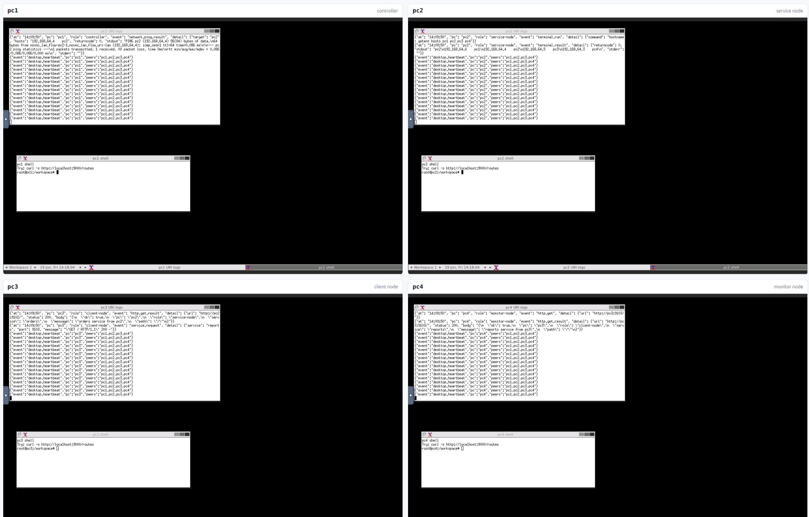

# noVNC LAN URI flow

This example shows how URI flows can define ready-made processes inside one
environment and across a local Docker network.

It starts four virtual computers:

- `pc1` - controller and notes app
- `pc2` - service node and orders app
- `pc3` - client node and reports app
- `pc4` - monitor node and health-check app

Each computer runs:

- a lightweight X11 desktop visible through noVNC,
- terminal windows inside that desktop,
- an HTTP URI agent on port `9000`,
- dynamic URI routes such as `pc://pc2/service/command/start`,
  `app://pc3/reports/command/render`, and `log://pc1/session/command/write`.

The dashboard displays all four noVNC desktops at once in iframes and can call
the URI agents from the browser. It also has a natural-language input that
turns a user request into a URI workflow and runs that workflow through the same
HTTP URI agents.

## Screenshot



The dashboard shows the four virtual computers in a 2x2 grid. Each desktop has a
terminal tailing its agent log: `pc1` (controller) announces the flow and reads
back the session log, `pc2` (service-node) starts the `orders` service and runs a
shell that lists the LAN hosts, `pc3` (client-node) starts `reports` and reads
`pc2` over HTTP, and `pc4` (monitor-node) reads `pc3`. Every line is a URI call -
the same `pc://...` / `log://...` resources the flow uses.

## Ports

| Computer | noVNC | URI API |
|----------|-------|---------|
| pc1 | `7901` | `9001` |
| pc2 | `7902` | `9002` |
| pc3 | `7903` | `9003` |
| pc4 | `7904` | `9004` |
| dashboard | `8192` | n/a |

Open:

```txt
http://127.0.0.1:8192/
```

Ports are defined in the example `.env`. If any port is already busy on your
machine, edit that file and run `make up` again. `make up` also writes
`dashboard/runtime-config.js`, so the browser uses the same port values as
Docker Compose.

LLM settings are read from the project root `.env`:

```env
LLM_MODEL=openrouter/...
OPENROUTER_API_KEY=...
```

The browser never receives these secrets. The dashboard container reads them,
calls LiteLLM server-side, validates the generated URI flow against the registry,
and only then executes it. If LiteLLM is not configured or the provider returns
an error, the dashboard uses a deterministic fallback flow so the example still
works offline.

## Run

```bash
cd v8/examples/novnc_lan_flow
make registry
make up
```

Then open the dashboard and press `Generate and run`. The textarea starts with
an example prompt:

```txt
Uruchom zadanie na czterech komputerach: dodaj notatkę na pc1, utwórz zamówienie na pc2, wygeneruj raport na pc3, sprawdź pc2 z monitora na pc4 i pokaż ostatnie logi.
```

The generated workflow is shown before the execution output, so you can inspect
which URI commands were chosen. You can also press `Run browser demo` to execute
a fixed URI sequence directly from JavaScript.

To run the declarative flow from Docker:

```bash
make flow
```

The flow in `flows/lan_demo.yaml` starts services on different computers, checks
network reachability, calls services across the Docker LAN, and writes logs that
are visible in the noVNC terminal windows.

To call the natural-language endpoint from shell:

```bash
curl -s http://127.0.0.1:8192/api/nl-flow \
  -H 'Content-Type: application/json' \
  -d '{"prompt":"Dodaj notatkę, utwórz zamówienie, wygeneruj raport i sprawdź pc2","execute":true}'
```

Stop everything:

```bash
make down
```

## What the flow demonstrates

The flow talks only in URI resources:

```yaml
steps:
  - id: start_pc2_service
    uri: pc://pc2/service/command/start
    payload:
      port: 9102
      message: "hello from pc2"

  - id: pc3_reads_pc2
    uri: pc://pc3/http/command/get
    payload:
      url: "http://pc2:9102/"
```

The implementation behind the URI can be a terminal command, Python service,
Docker container, firmware handler, or remote HTTP adapter. The flow does not
change as long as the URI contract stays the same.

The natural-language generator uses the same rule: it may choose only routes
that exist in the registry and are marked safe for the browser/LLM demo. Shell
routes such as `pc://pc2/terminal/command/run` stay available in the registry,
but the generator filters them out.

## Application routes

Each computer exposes one simple application:

```txt
app://pc1/notes/command/add
app://pc1/notes/query/list
app://pc2/orders/command/create
app://pc2/orders/query/list
app://pc3/reports/command/render
app://pc3/reports/query/latest
app://pc4/monitor/command/check
app://pc4/monitor/query/status
```

These routes show the intended model: the flow does not import SDKs or call
language-specific functions directly. It addresses capabilities by URI, and the
local agent on each computer maps that URI to Python code, a shell command, a
container, or another adapter.

## Verified run

`make flow` runs `flows/lan_demo.yaml` against the four live containers. A
successful run reports `ok: true`, `routeCount: 16`, and every step green:

| step | URI | what happens |
|------|-----|--------------|
| announce_start | `log://pc1/session/command/write` | pc1 records `flow.started` |
| start_pc2_service | `pc://pc2/service/command/start` | pc2 serves `orders` on `:9102` |
| start_pc3_service | `pc://pc3/service/command/start` | pc3 serves `reports` on `:9103` |
| pc1_checks_pc2 | `pc://pc1/network/command/ping` | pc1 pings pc2 (0% loss) |
| pc3_reads_pc2 | `pc://pc3/http/command/get` | pc3 GETs `http://pc2:9102/` -> 200 |
| pc4_reads_pc3 | `pc://pc4/http/command/get` | pc4 GETs `http://pc3:9103/` -> 200 |
| pc2_shell_observes_lan | `pc://pc2/terminal/command/run` | pc2 shell lists pc1..pc4 LAN hosts |
| read_pc1_logs | `log://pc1/session/query/recent` | pc1 returns the recorded log trail |

The orchestrator only ever sends `{uri, payload}`; each container resolves the
URI to its own native action (HTTP service, ping, curl, shell, log store), which
is exactly the cross-environment behaviour the screenshot shows.

## Why noVNC

The noVNC layer makes the example inspectable: each virtual computer has its own
desktop and terminals, while the dashboard shows all four at once. You can see
that the same flow affects multiple machines in the same local network.

## Test without Docker GUI

```bash
make test
```

The test checks the flow parser, registry generation, URI route definitions, and
dashboard iframe layout without building the noVNC images.
